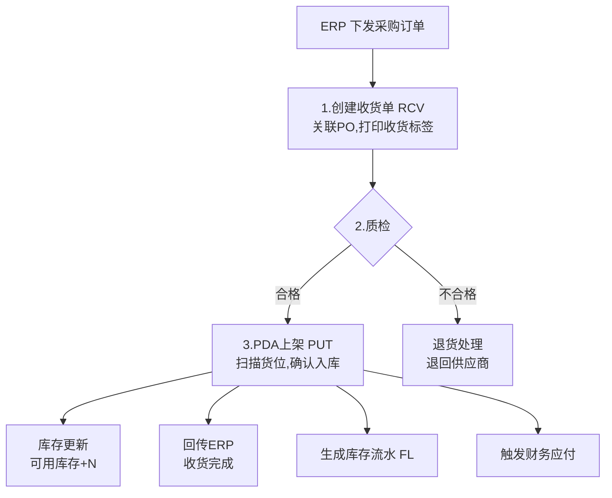

# 04-入库流程详解

## 整体流程

## 单据设计

### 收货单 RCV
| 字段 | 来源 |
|:--|:--|
| 收货单号 RCV{日期}-{序号} | 系统生成 |
| 来源采购单号 PO{日期}-{序号} | ERP下发 |
| 供应商 | 继承PO |
| 仓库/库区 | 仓管选择 |
| 商品明细（编码/名称/规格/单位）| 继承PO |
| 采购数量 | PO行 |
| 实收数量 | 仓管录入 |
| 合格数量 | 质检后填入 |
| 不合格数量/原因 | 质检后填入 |
| 收货标签条码 | 系统生成打印 |

### 上架单 PUT
| 字段 | 来源 |
|:--|:--|
| 上架单号 PUT{日期}-{序号} | 系统生成 |
| 来源收货单号 | 继承RCV |
| 商品/实收数量 | 继承RCV |
| 推荐货位 | 系统计算（空闲货位优先） |
| 实际上架货位 | PDA扫描确认 |

## 业务规则
- 超收拦截：实收数量 > PO未收货数量 → 阻断
- 质检锁定：质检期间库存状态=冻结，不可销售
- 上架完成=库存可用：PDA确认上架后，库存从冻结→可用
