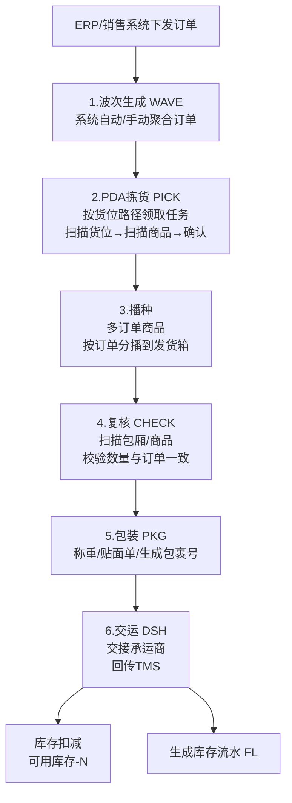

# 05-出库流程详解

> 核心模块，日均处理出库单 20,000+。6 个仓库并行作业。

## 整体流程

## 单据体系

| 单据 | 前缀 | 来源 | 核心动作 |
|:--|:--|:--|:--|
| 波次单 | WAVE | 系统/手动生成 | 聚合订单、分配拣货员 |
| 拣货单 | PICK | 波次下推 | PDA拣货、扫描确认 |
| 复核单 | CHECK | 拣货完成 | 校验数量准确性 |
| 包裹 | PKG | 复核通过 | 称重、贴面单 |
| 交运单 | DSH | 包裹聚合 | 交接承运商 |

## 波次策略

| 类型 | 规则 |
|:--|:--|
| 系统波次 | 按承运商+线路+发货优先级自动聚合，定时触发 |
| 手动波次 | 仓管手动圈选订单生成波次（紧急订单/异常处理） |
| 波次切分 | 单波次上限 50 单，超出自动拆波 |

## 拣货模式

| 模式 | 适用场景 |
|:--|:--|
| 按单拣货 | 大件/异形商品 |
| 边拣边分 | 多订单同时拣，PDA 提示分播到对应发货箱 |
| 先拣后播 | 大批量同 SKU，集中拣货后统一播种 |

## 业务规则
- 拣货超量拦截：拣货量>订单量→PDA报错
- 复核不通过→回退拣货，重新拣
- 包装完成=库存扣减触发点
- 交运确认=订单状态完结
