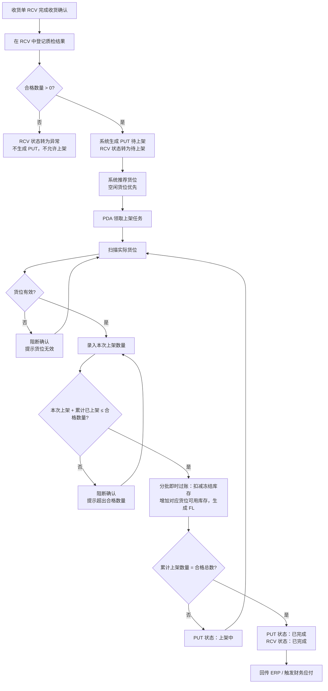
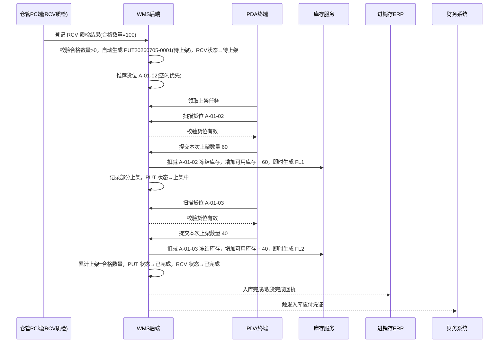

# 上架单_业务流程推演

> 角色：业务流程推演 | 类型：执行作业单
> 使用 2026 年示例数据，推演质检合格生成 PUT 到 PDA 上架完成、库存转可用的全过程。

## 1. 沙盘数据

| 项 | 值 |
|:--|:--|
| 来源收货单 | RCV20260705-0001 |
| 上架单号 | PUT20260705-0001 |
| 仓库 | 上海一仓 |
| 商品 | SKU003 强盛定制纯木浆A4复印纸 600x400x280 |
| 合格数量 | 100 件 |
| 推荐货位 | A-01-02 |
| 上架人 | 仓管员-陈明 |
| 操作日期 | 2026-07-05 |

## 2. 业务流程图

## 3. 系统时序图

## 4. 主流程步骤

| 步骤 | 角色 | 输入 | 系统处理 | 输出 |
|:--:|:--|:--|:--|:--|
| 1 | 仓管/质检 | 合格数量 | 校验合格数量 > 0 并保存 | 可生成 PUT，RCV 状态转待上架 |
| 2 | WMS | RCV 合格品数据 | 自动生成 PUT 待上架 | PUT 待上架 |
| 3 | WMS | 仓库、商品 | 推荐空闲货位 | 推荐货位 |
| 4 | 仓管 PDA | 实际货位条码 | 校验货位有效性 | 可录入数量 |
| 5 | 仓管 PDA | 本次上架数量 | 校验累计上架 ≤ 合格总数 | 即时执行分批过账（冻结转可用，生成 FL） |
| 6 | WMS | 累计数量 | 每次提交更新 PUT/RCV 进度，判断是否全部完成 | 状态由“待上架”转为“上架中”或“已完成” |
| 7 | 系统 | 入库完成事件 | 上架全部完成后（PUT/RCV 状态转已完成），回传 ERP 并触发财务应付 | 下游同步 |

## 5. 示例推演

### 5.1 第一次确认（分批即时过账）

| 字段 | 值 |
|:--|:--|
| 合格数量 | 100 件 |
| 历史已上架 | 0 件 |
| 实扫货位 | A-01-02 |
| 本次上架 | 60 件 |
| 累计上架 | 60 件 |
| 状态 | 上架中 |
| 库存结果 | 本批 60 件从冻结转为可用，即时生成流水 `FL20260705-00000001` |

### 5.2 第二次确认（全部完成）

| 字段 | 值 |
|:--|:--|
| 历史已上架 | 60 件 |
| 实扫货位 | A-01-03 |
| 本次上架 | 40 件 |
| 累计上架 | 100 件 |
| 状态 | 已完成 |
| 库存结果 | 本批 40 件从冻结转为可用，即时生成流水 `FL20260705-00000002`；PUT/RCV 联同转为已完成，触发回传和应付 |

## 6. 异常流程

### 6.1 RCV 质检登记全部不合格

- 条件：收货单中登记的合格数量为 0。
- 处理：RCV 状态转为异常，不生成 PUT，不允许上架。
- 结果：货品在收货单中登记不合格原因，等待退货处理（二期），库存仍为冻结不转可用。

### 6.2 扫描无效货位

- 条件：货位不存在、停用或不属于当前仓库。
- 处理：阻断确认，提示货位无效。
- 结果：PUT 状态不变，不写入上架明细。

### 6.3 上架超量

- 条件：合格 100，历史已上架 60，本次录入 50。
- 处理：阻断确认，提示累计上架数量不能大于合格数量。
- 结果：需调整本次上架数量≤40。

## 7. 流程边界

- PUT 不登记质检结果，直接继承 RCV 明细的合格数量。
- PUT 不处理退货；质检不合格品不生成上架任务。
- PDA 确认上架为分批即时过账，每次确认的数量即时进入可用并即时生成对应的 FL，不等待整单完成。
