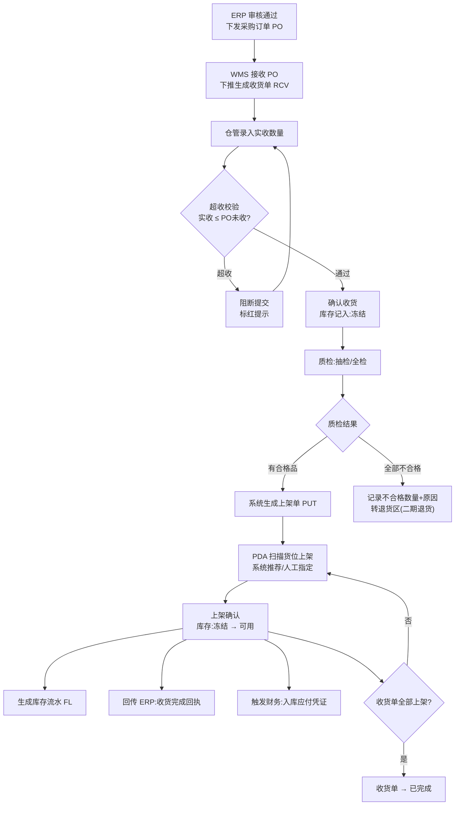
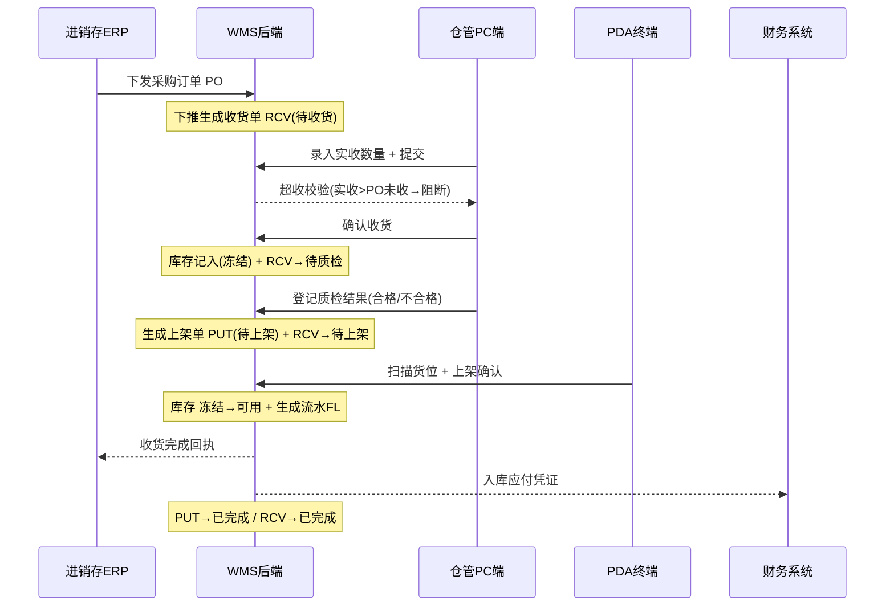
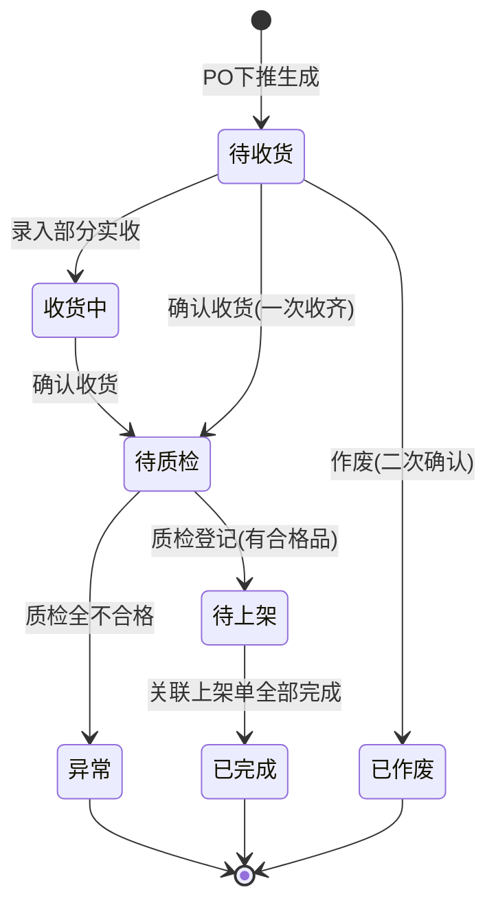
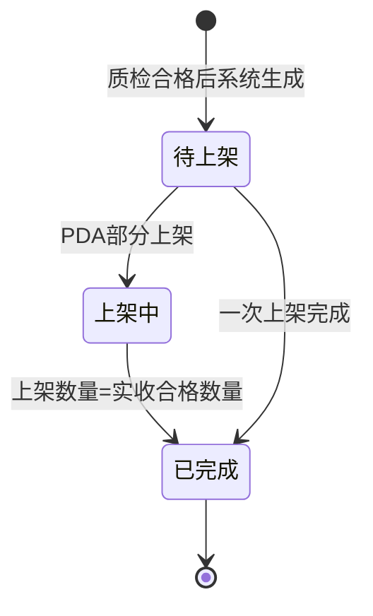

# PRD-01 入库管理

> 强盛科技 WMS | 模块：入库管理 | 版本：v1.0 | 角色：产品经理
>
> 关联 context：`04-入库流程详解` `02-上下游关联系统` `06-库存管理规则` `09-单据命名规则` `10-产品设计通用规范` `11-字段校验规范`

---

## 1. 业务背景

### 1.1 痛点
- 采购到货后，收货、质检、上架三个环节纸质流转，数据不联动，账实不符。
- 收货数量靠人工比对采购单，**超收/漏收**发现不及时，事后对账成本高。
- 货位靠仓管记忆，新人上手慢，找货、放货效率低。
- 入库结果无法实时回传 ERP 与财务，采购应付、可用库存滞后。

### 1.2 目标
- 以**采购订单 PO** 为源头，全链路单据驱动：收货 → 质检 → 上架，数据一次录入、多方共享。
- 关键节点**强控**：超收阻断、质检未过不可上架、上架前库存冻结不可销售。
- 上架完成实时回传 ERP（收货完成回执）+ 触发财务应付 + 生成库存流水，做到账实同步。

---

## 2. 功能范围

### 2.1 In Scope（一期）
| 功能 | 端 | 说明 |
|:--|:--|:--|
| 收货单管理 | PC | 基于 PO 下推创建，录入实收，打印收货标签 |
| 质检登记 | PC | 抽检/全检，登记合格/不合格数量与原因 |
| 上架作业 | PDA | 扫描货位，系统推荐 + 人工指定，确认入库 |
| 入库回传 | 系统 | 回传 ERP 收货完成、触发财务应付、生成库存流水 |

### 2.2 Not In Scope（一期不做）
- 退货单（RTV）退回供应商的完整流程 → 一期仅标记"不合格数量+原因"，退货处理二期。
- 收货预约、月台/卸货区调度。
- 硬件对接（扫码枪、标签打印机驱动）——PRD 只定义"打印收货标签"动作，不涉及硬件选型。
- 收货单的多级审核流（执行层单据，不设审批）。

---

## 3. 单据定位

| 单据 | 前缀 | 定位 | 生成方式 |
|:--|:--|:--|:--|
| 收货单 | RCV | 记录"实际收到多少、质检结果如何"，是采购到货的确认凭证 | 从 PO **下推**生成（不允许无源头手工新建） |
| 上架单 | PUT | 记录"合格品放到哪个货位"，是库存可用的触发凭证 | 收货单质检合格后**系统自动生成** |
| 库存流水 | FL | 记录每一次库存变动的明细账 | 上架确认时系统自动生成 |

> 单据编号规则（见 `09`）：`RCV{YYYYMMDD}-{4位}`、`PUT{YYYYMMDD}-{4位}`、`FL{YYYYMMDD}-{8位}`，序号每日从 0001 起，已确认/作废单号不回收。

---

## 4. 业务流程图（Business Flow）

---

## 5. 系统时序图（System Sequence）

---

## 6. 业务场景

| # | 场景 | 处理 |
|:--:|:--|:--|
| 1 | **正常入库** | PO 下推 → 实收=采购数 → 质检全合格 → 全部上架 → 收货单完成 |
| 2 | **部分收货** | 实收 < PO 数量 → 确认收货后 RCV 仍可继续收货（收货中），PO 未收余量保留 |
| 3 | **超收** | 实收 > PO 未收数量 → 提交时阻断标红，不允许确认 |
| 4 | **质检部分不合格** | 合格品生成上架单正常上架；不合格数量+原因登记，转退货区（二期退货流程处理） |
| 5 | **质检全部不合格** | 不生成上架单，库存不转可用，RCV 标记异常，等退货处理 |
| 6 | **一单多货位上架** | 同一上架单商品可分多货位，PDA 多次扫描确认，累计达实收数量后 PUT 完成 |
| 7 | **收货单作废** | 仅"待收货"状态可作废（二次确认弹窗），已确认收货后不可作废 |

---

## 7. 状态机

### 7.1 收货单 RCV

| 状态 | 含义 | 可执行动作 | 配色建议 |
|:--|:--|:--|:--|
| 待收货 | PO 下推后未收货 | 录入实收 / 确认收货 / 作废 | 蓝 |
| 收货中 | 已收部分 | 继续录入 / 确认收货 | 蓝 |
| 待质检 | 已确认收货，等质检 | 登记质检 | 橙 |
| 待上架 | 质检完成有合格品 | （由上架单驱动） | 橙 |
| 异常 | 质检全不合格 | 转退货（二期） | 红 |
| 已完成 | 全部上架 | — | 绿 |
| 已作废 | 作废 | — | 灰 |

### 7.2 上架单 PUT

| 状态 | 含义 | 可执行动作 | 配色建议 |
|:--|:--|:--|:--|
| 待上架 | 系统生成待作业 | PDA 上架确认 | 橙 |
| 上架中 | 部分货位已上架 | 继续上架 | 蓝 |
| 已完成 | 全部上架，库存转可用 | — | 绿 |

> 遵守 `10` 规范：**状态变更只能通过动作按钮触发**，不允许直接编辑状态字段；按钮不可用时隐藏，不展示灰色 disabled 态。

---

## 8. 字段清单

### 8.1 收货单 RCV

| 字段 | 来源 | 必填 | 校验/说明 |
|:--|:--|:--:|:--|
| 收货单号 | 系统生成 | — | `RCV{YYYYMMDD}-{4位}`，不可编辑 |
| 来源采购单号 PO | ERP 下发 | 是 | 只读，不可修改 |
| 供应商 | 继承 PO | — | 只读，快照存储 |
| 仓库 / 库区 | 仓管选择 | 是 | 下拉，库区默认"收货区" |
| 单据状态 | 系统 | — | 见状态机，只读 |
| 商品编码 | 继承 PO | — | 只读，快照 |
| 商品名称 / 规格 / 单位 | 继承 PO | — | 只读，快照 |
| 采购数量 | PO 行 | — | 只读 |
| 已收数量 | 系统累计 | — | 只读（部分收货累加） |
| 实收数量 | 仓管录入 | 是 | 正整数 >0；**实收 ≤ PO未收数量**（超收阻断） |
| 合格数量 | 质检填入 | 是 | 正整数 ≥0，≤ 实收数量 |
| 不合格数量 | 质检填入 | — | = 实收 − 合格，系统自动计算 |
| 不合格原因 | 质检填入 | 条件必填 | 有不合格数量时必填，枚举+备注 |
| 收货标签条码 | 系统生成 | — | 确认收货后可打印 |
| 备注 | 仓管录入 | 否 | ≤200 字符 |

### 8.2 上架单 PUT

| 字段 | 来源 | 必填 | 校验/说明 |
|:--|:--|:--:|:--|
| 上架单号 | 系统生成 | — | `PUT{YYYYMMDD}-{4位}`，不可编辑 |
| 来源收货单号 | 继承 RCV | — | 只读 |
| 单据状态 | 系统 | — | 见状态机，只读 |
| 商品 / 合格数量 | 继承 RCV | — | 只读，快照 |
| 推荐货位 | 系统计算 | — | 空闲货位优先，可为空 |
| 实际上架货位 | PDA 扫描 | 是 | 扫描货位条码带入，支持人工指定 |
| 本次上架数量 | PDA 录入 | 是 | 正整数 >0，累计 ≤ 合格数量 |
| 上架人 / 时间 | 系统 | — | 取当前操作人 + 时间戳 |

> 校验时机遵守 `11`：实时失焦校格式/范围；保存草稿宽松（仅严重错误阻断）；**确认/提交时全量严格校验**。

---

## 9. 业务规则汇总

| # | 规则 | 说明 |
|:--:|:--|:--|
| R1 | **超收阻断** | 实收数量 > PO 未收货数量 → 提交阻断，标红提示 |
| R2 | **质检冻结** | 确认收货后库存记为"冻结"状态，质检期间不可销售/占用 |
| R3 | **上架转可用** | PDA 确认上架后，库存从"冻结"→"可用"（见 `06`） |
| R4 | **无源不新建** | 收货单必须由 PO 下推，禁止无采购来源手工创建 |
| R5 | **快照存储** | 供应商、商品信息在单据中快照存储，主数据后续变更不影响历史单据 |
| R6 | **不合格闭环** | 有不合格数量必须填写原因，一期仅登记，退货二期 |
| R7 | **作废限制** | 仅"待收货"可作废，已确认收货不可作废 |

---

## 10. 上下游对接（见 `02`）

| 方向 | 数据 | 触发时机 |
|:--|:--|:--|
| ERP → WMS | 采购订单 PO | ERP 采购单审核通过后下发 |
| WMS → ERP | 收货完成回执 | 上架确认（入库完成） |
| WMS → 财务 | 入库应付凭证 | 采购入库确认 |
| PDA ↔ WMS | 上架扫描/确认 | 实时 API |

---

## 11. 页面清单（供反重力指令使用）

| # | 页面 | 端 | 关键要素 |
|:--:|:--|:--|:--|
| P1 | 收货单列表 RcvList | PC | Tab 按状态过滤；列：单号/PO/供应商/仓库/状态/创建时间；行操作按状态显隐 |
| P2 | 收货单详情/录入 RcvDetail | PC | 头部信息（PO/供应商只读）+ 商品明细表（实收可编辑）+ 底部动作栏（确认收货/作废/打印标签） |
| P3 | 质检登记 QcForm | PC | 明细录入合格/不合格数量+原因；提交生成上架单 |
| P4 | 上架作业 PutTask | PDA | 大字大按钮；扫货位→扫商品→录数量→确认；推荐货位高亮；语音+震动反馈 |
| P5 | 上架单列表 PutList | PC | 查看上架进度；列：上架单号/收货单号/状态/上架进度 |

> 页面设计遵守 `10`：PC 表格默认 20 条/页，危险操作二次确认，按钮不可用时隐藏；PDA 扫码优先、离线自动同步。

---

## 附录：与进销存世界观一致性
- 品牌统一为**强盛科技**，不混入京东/其他品牌。
- 上游 ERP = 强盛科技进销存（采购/销售模块），非第三方。
- 与进销存"询比价→采购订单"链路衔接：本 PRD 起点即"ERP 审核通过的 PO"。
