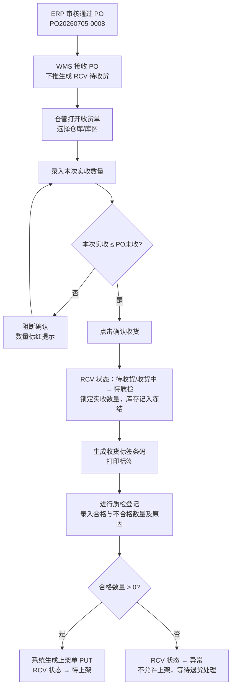
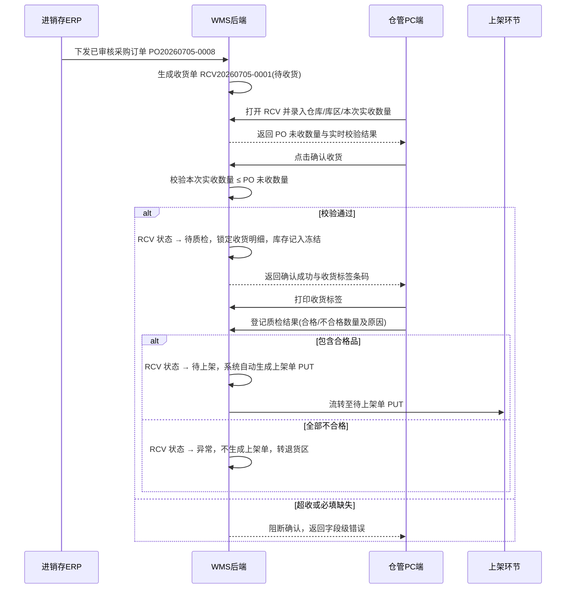

# 收货单_业务流程推演

> 角色：业务流程推演 | 类型：执行作业单
> 覆盖收货单从 PO 下推到确认收货、打印标签、进入质检/上架的业务与系统交互。

## 1. 示例数据

| 项 | 值 |
|:--|:--|
| 采购单号 | PO20260705-0008 |
| 收货单号 | RCV20260705-0001 |
| 供应商 | 苏州星河包装材料有限公司 |
| 仓库/库区 | 上海一仓 / 收货区 |
| 商品 | SKU003 强盛定制纯木浆A4复印纸 600x400x280 |
| 采购数量 | 100 件 |
| 历史已收 | 40 件 |
| PO 未收 | 60 件 |
| 本次实收 | 60 件 |
| 操作人 | 仓管员-陈明 |
| 操作日期 | 2026-07-05 |

## 2. 业务流程图

## 3. 系统时序图

## 4. 主流程步骤

| 步骤 | 角色 | 输入 | 系统处理 | 输出 |
|:--:|:--|:--|:--|:--|
| 1 | ERP | 已审核 PO | 下发采购订单到 WMS | PO 数据进入 WMS |
| 2 | WMS | PO 明细 | 生成 RCV 待收货单，带入 PO 快照 | RCV 待收货 |
| 3 | 仓管 | 到货实物 | 打开 RCV，核对供应商和商品 | 可录入页面 |
| 4 | 仓管 | 仓库/库区、本次实收数量 | 保存或确认收货 | 保存或进入校验 |
| 5 | WMS | 本次实收数量、PO 未收数量 | 校验超收、必填、数量格式 | 成功或错误提示 |
| 6 | WMS | 校验通过数据 | 锁定 RCV 实收数量，写入确认人/确认时间 | RCV 待质检，库存记入冻结 |
| 7 | 仓管 | 待质检 RCV | 打印收货标签 | 标签贴到货物/托盘 |
| 8 | 仓管/质检 | 质检合格/不合格数量、原因 | 在 RCV 中进行质检登记，校验合格+不合格=实收 | 状态转为待上架（生成 PUT）或异常 |

## 5. 异常流程

### 5.1 超收阻断

- 条件：`本次实收数量 > PO未收数量`。
- 示例：PO 未收 60 件，仓管录入 65 件。
- 系统处理：确认收货失败，明细行本次实收数量标红，提示“本次实收数量不能大于 PO 未收数量”。
- 结果：RCV 保持待收货/收货中，仓管修改数量后重新确认。

### 5.2 质检全部不合格

- 条件：质检登记结果为全部不合格（合格数量=0）。
- 系统处理：收货单状态转为异常，不生成上架单，不允许流转到上架，库存不转可用。
- 结果：等待退货处理；一期只登记不合格数量和原因，完整退货流程为二期。

### 5.3 重复确认

- 条件：已确认收货的 RCV 再次触发确认收货。
- 系统处理：阻断，提示“非待收货/收货中状态不可操作确认收货”。
- 结果：RCV 状态保持不变。

## 6. 流程边界

- 收货单确认收货是实收录入锁定；入库完成以质检通过后的上架确认作为库存可用和状态流转已完成的触发点。
- 收货单不写审核状态，不做反审核。
- 收货单质检登记为 RCV 内部环节，质检数据直接写入 RCV 明细，无需生成和管理独立的外部 QC 单。
