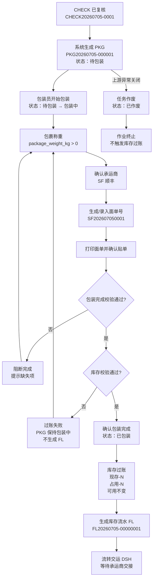
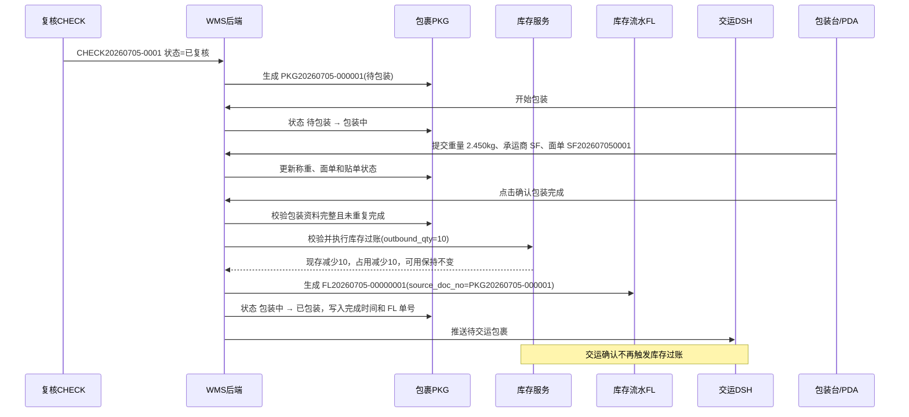

# 包裹_业务流程推演

> 角色：业务流程推演 | 类型：执行作业单
> 使用 2026 年示例数据，推演复核通过下推、称重、贴面单、确认包装完成、库存过账、FL 生成和流转交运。

## 1. 沙盘数据

| 项 | 值 |
|:--|:--|
| 来源波次 | WAVE20260705-0001 |
| 来源拣货单 | PICK20260705-0001 |
| 来源复核单 | CHECK20260705-0001 |
| 包裹号 | PKG20260705-000001 |
| 仓库 | 上海一仓 |
| 包装员 | 包装员-周婷 |
| 包装台 | WS-PACK-01 |
| 承运商 | SF 顺丰 |
| 面单号 | SF202607050001 |
| 包装完成时间 | 2026-07-05 09:55:00 |

### 1.1 包裹明细

| 行 | 货位 | SKU | 商品 | 出库数量 | 单位 |
|:--:|:--|:--|:--|--:|:--|
| 1 | A-01-02 | SKU004 | 得力多功能计算器 | 10 | 台 |

## 2. 业务流程图

## 3. 系统时序图

## 4. 主流程步骤

| 步骤 | 角色 | 输入 | 系统处理 | 输出 |
|:--:|:--|:--|:--|:--|
| 1 | 系统 | CHECK 已复核 | 下推生成 PKG | PKG 待包装 |
| 2 | 包装员 | 开始包装 | 校验用户权限 | PKG 包装中 |
| 3 | 包装员 | 重量 | 校验重量大于 0 | 保存称重结果 |
| 4 | 包装员 | 承运商 | 校验承运商启用 | 保存承运商 |
| 5 | 包装员 | 面单号 | 生成/录入并打印面单 | 面单已打印 |
| 6 | 包装员 | 贴单确认 | 记录已贴单 | 允许包装完成校验 |
| 7 | 系统 | 包装完成提交 | 校验资料和库存快照 | 允许或阻断过账 |
| 8 | 系统 | 出库数量 | 更新现存和占用，可用保持不变 | 库存实扣完成 |
| 9 | 系统 | 过账结果 | 生成 FL，写入 PKG | PKG 已包装 |
| 10 | 系统 | 已包装包裹 | 流转交运 | DSH 待交运 |

## 5. 示例推演

### 5.1 正常包装完成

| 项 | 值 |
|:--|:--|
| 包裹号 | PKG20260705-000001 |
| 来源复核单 | CHECK20260705-0001 |
| 重量 | 2.450kg |
| 承运商 | SF 顺丰 |
| 面单号 | SF202607050001 |
| 面单打印状态 | 已打印 |
| 是否已贴单 | 是 |
| 出库数量 | SKU004 x 10 |
| 结果 | PKG 已包装，生成 FL20260705-00000001，流转 DSH |

### 5.2 库存过账结果

| SKU | 过账前现存 | 过账前占用 | 过账前可用 | 出库数量 | 过账后现存 | 过账后占用 | 过账后可用 |
|:--|--:|--:|--:|--:|--:|--:|--:|
| SKU004 | 120 | 10 | 110 | 10 | 110 | 0 | 110 |

## 6. 异常流程

### 6.1 未称重

- 条件：`package_weight_kg` 为空或小于等于 0。
- 处理：阻断确认包装完成，提示“请先完成包裹称重”。
- 结果：PKG 保持包装中，不触发库存过账。

### 6.2 未打印或未贴面单

- 条件：面单号为空、打印状态不是已打印，或未确认贴单。
- 处理：阻断确认包装完成。
- 结果：PKG 保持包装中，不生成 FL。

### 6.3 库存快照不足

- 条件：SKU004 出库数量 10，但包装完成时占用只有 9。
- 处理：库存校验失败，整体回滚。
- 结果：PKG 不变为已包装，不更新库存三口径，不生成 FL。

### 6.4 重复提交

- 条件：PKG 已包装，或已经存在 FL 单号。
- 处理：阻断再次确认。
- 结果：不重复影响库存，不新增 FL。

## 7. 流程边界

- PKG 不提供新增入口，只由 CHECK 已复核后系统下推生成。
- PKG 的库存实扣只发生在确认包装完成时。
- 包装完成之后，DSH 只负责承运商交接和订单状态完结，不再触发库存过账。
- 包装完成后的撤销、冲销或逆向出库不在本套件范围内。
