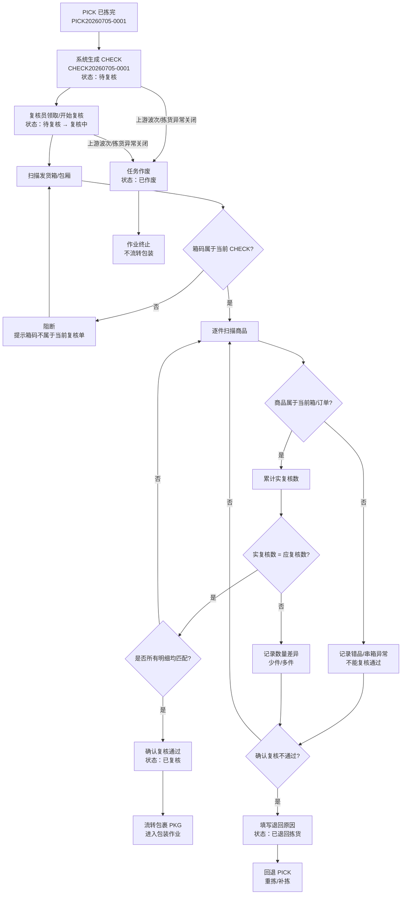
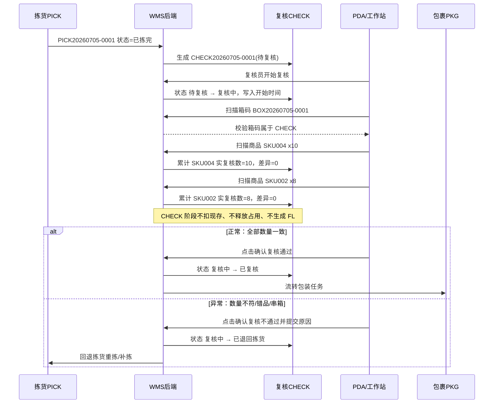

# 复核单_业务流程推演

> 角色：业务流程推演 | 类型：执行作业单
> 使用 2026 年示例数据，推演 PICK 完成下推、扫箱、扫商品、数量校验、通过流转包装和不通过回退拣货。

## 1. 沙盘数据

| 项 | 值 |
|:--|:--|
| 来源波次 | WAVE20260705-0001 |
| 来源拣货单 | PICK20260705-0001 |
| 复核单号 | CHECK20260705-0001 |
| 仓库 | 上海一仓 |
| 复核员 | 复核员-陈敏 |
| 复核端 | 工作站 WS-CHECK-01 |
| 发货箱/包厢 | BOX20260705-0001 |
| 开始时间 | 2026-07-05 09:35:00 |

### 1.1 复核明细

| 行 | 发货箱 | SKU | 商品 | 应复核数 | 单位 |
|:--:|:--|:--|:--|--:|:--|
| 1 | BOX20260705-0001 | SKU004 | 得力多功能计算器 | 10 | 台 |
| 2 | BOX20260705-0001 | SKU002 | 晨光按动式中性笔黑色 | 8 | 支 |

## 2. 业务流程图

## 3. 系统时序图

## 4. 主流程步骤

| 步骤 | 角色 | 输入 | 系统处理 | 输出 |
|:--:|:--|:--|:--|:--|
| 1 | 系统 | PICK 已拣完 | 生成 CHECK，带入箱码和应复核明细 | CHECK 待复核 |
| 2 | 复核员 | 开始复核 | 校验用户权限 | CHECK 复核中 |
| 3 | PDA/工作站 | 扫描发货箱/包厢 | 校验箱码归属 | 允许扫商品或阻断 |
| 4 | PDA/工作站 | 扫描商品 | 校验商品归属并累计数量 | 更新实复核数 |
| 5 | 系统 | 实复核数 | 更新待扫描数量；多件/错品/串箱即时标记差异 | 明细待复核、已匹配或有差异 |
| 6A | 复核员 | 确认复核通过 | 校验全部明细已匹配且无错品/串箱 | CHECK 已复核，流转 PKG |
| 6B | 复核员 | 确认复核不通过 | 校验存在差异且原因必填 | CHECK 已退回拣货，回退 PICK |

## 5. 示例推演

### 5.1 正常复核通过

| 项 | 行 1 | 行 2 |
|:--|:--|:--|
| 发货箱 | BOX20260705-0001 | BOX20260705-0001 |
| SKU | SKU004 | SKU002 |
| 应复核数 | 10 | 8 |
| 实复核数 | 10 | 8 |
| 差异数量 | 0 | 0 |
| 明细状态 | 已匹配 | 已匹配 |

结果：
- CHECK 状态由复核中变为已复核。
- 系统流转下游 PKG 待包装。
- CHECK 不扣减现存、不释放占用、不生成 FL。

### 5.2 数量不符回退拣货

| 项 | 值 |
|:--|:--|
| 发货箱 | BOX20260705-0002 |
| SKU | SKU002 晨光按动式中性笔黑色 |
| 应复核数 | 8 |
| 实复核数 | 7 |
| 差异数量 | -1 |
| 差异类型 | 少件 |
| 退回原因 | 少件 |
| 结果 | CHECK 已退回拣货，关联 PICK 回到重拣/补拣处理 |

## 6. 异常流程

### 6.1 扫错发货箱/包厢

- 条件：当前应扫 `BOX20260705-0001`，实扫 `BOX20260705-0099`。
- 处理：阻断继续扫商品，提示“箱码不属于当前复核单”，并语音+震动。
- 结果：CHECK 保持复核中，不更新实复核数。

### 6.2 扫错商品

- 条件：当前箱内应包含 `SKU004`、`SKU002`，实扫 `SKU007`。
- 处理：记录错品异常，提示“商品不属于当前复核单，请核对”。
- 结果：不允许确认复核通过，需确认复核不通过并回退拣货。

### 6.3 少件

- 条件：应复核 8 件，实扫 7 件。
- 处理：复核员确认不通过后，系统固化差异 `7 - 8 = -1`，差异类型=少件。
- 结果：不能复核通过，需退回拣货。

### 6.4 多件

- 条件：应复核 5 件，实扫 6 件。
- 处理：系统计算差异 `6 - 5 = +1`，差异类型=多件。
- 结果：不能复核通过，需退回拣货核对是否多拣或串货。

## 7. 流程边界

- CHECK 不提供新增入口，只由 PICK 已拣完后系统下推生成。
- CHECK 不执行包装、称重、贴面单、交运。
- CHECK 复核通过只代表校验完成；库存扣减仍在下游 PKG 包装完成时发生。
- CHECK 复核不通过只回退拣货，不在本单释放占用、不调整现存、不生成 FL。
