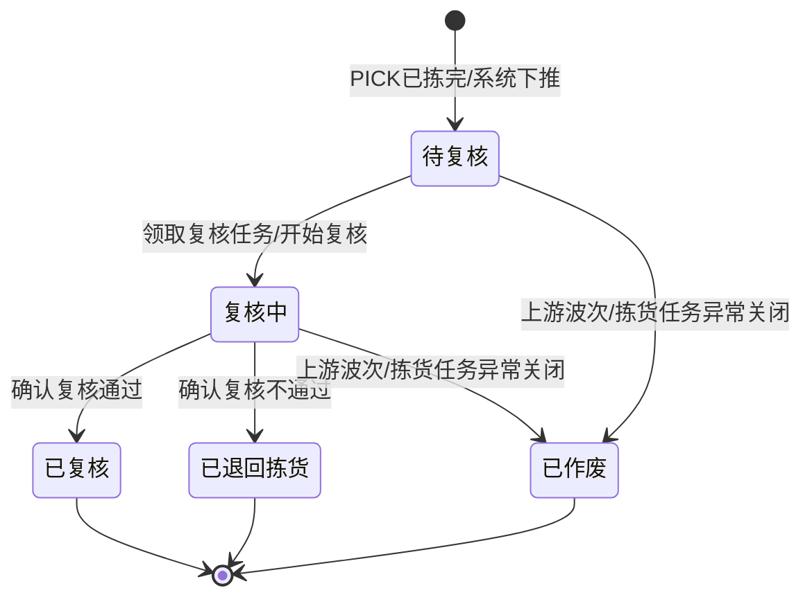

# 复核单主PRD

> 角色：主PRD | 类型：执行作业单
> 权威层级：context/ > 出库管理主PRD > 拣货单套件 > 本文件
> 关联文件：`复核单字段清单.md` `复核单_业务规则规格.md` `复核单_业务流程推演.md` `复核单_用例数据推演.md`

## 1. 业务背景

复核单（CHECK）是 Forge WMS 出库执行层作业单，来源于上游拣货单（PICK）完成后的系统下推。复核员在 PDA 或工作站扫描发货箱/包厢条码，再逐件扫描商品条码，校验发货箱内商品和数量是否与订单应出库结果一致。

在日均 20,000+ 单、6 个仓库并行作业的出库场景中，复核位于拣货和包装之间，是拦截漏拣、错拣、串箱、数量不一致的关键节点。复核通过后才允许进入下游包裹（PKG）称重、贴面单和包装完成；复核不通过必须回退拣货重拣或补拣。

复核单只做作业校验，不做库存过账：不扣减现存、不释放占用、不生成库存流水 FL。库存实扣以 `05-出库流程详解` 和出库主 PRD 为准，在下游包裹完成时触发。

## 2. 功能范围

### 2.1 In Scope

| 功能 | 端 | 说明 |
|:--|:--|:--|
| PICK 完成下推 CHECK | 系统 | 只能由已拣完的 PICK 生成，不提供手工新增入口 |
| 领取/开始复核 | PDA/工作站 | 复核员领取待复核任务，状态进入复核中 |
| 扫描发货箱/包厢 | PDA/工作站 | 校验箱码是否属于当前 CHECK |
| 扫描商品 | PDA/工作站 | 按商品条码累计实复核数，校验是否属于当前订单/发货箱 |
| 数量一致校验 | 系统 | 对比应复核数、实复核数和差异数量 |
| 复核通过 | PDA/工作站 | 全部明细数量一致后，状态变为已复核并流转 PKG |
| 复核不通过 | PDA/工作站 | 数量不符、错品、串箱等异常确认后回退拣货 |
| PC 列表/详情查看 | PC | 查看复核进度、差异、扫码记录和上下游关联 |

### 2.2 Out Scope

- 不提供“新增复核单”入口，CHECK 必须来自已拣完 PICK。
- 不增加审核流，不出现待审核、已审核、反审核等状态。
- 不在 CHECK 中执行包装、称重、面单、交运操作；这些属于 PKG、DSH。
- 不在 CHECK 中扣减现存库存、不释放占用、不生成 FL。
- 不处理快递/运输系统对接，不回传 TMS。
- 不做 PDA、扫码枪、复核台硬件选型。

## 3. 单据定位

| 项 | 说明 |
|:--|:--|
| 单据名称 | 复核单 |
| 单据编码 | CHECK |
| 单号规则 | `CHECK{YYYYMMDD}-{4位序号}`，如 `CHECK20260705-0001` |
| 上游来源 | 拣货单 PICK 已拣完后系统下推 |
| 下游去向 | 包裹 PKG；复核通过后进入包装作业 |
| 异常去向 | 复核不通过时回退拣货，要求重新拣货/补拣后再复核 |
| 业务定位 | 校验发货箱/包厢内商品与数量是否与订单应出库结果一致 |
| 生成方式 | 系统根据 PICK 完成结果生成，不允许无来源创建 |

## 4. 业务场景

| # | 场景 | 示例 | 系统处理 |
|:--:|:--|:--|:--|
| 1 | 正常复核 | 发货箱 `BOX20260705-0001` 内 SKU004 应复核 10 台，实扫 10 台 | 明细匹配，允许继续下一行 |
| 2 | 扫错发货箱 | 当前 CHECK 应扫 `BOX20260705-0001`，误扫 `BOX20260705-0099` | 阻断作业，提示箱码不属于当前复核单 |
| 3 | 扫错商品 | 当前发货箱不包含 SKU007，现场扫到 SKU007 | 记录错品异常，不允许复核通过 |
| 4 | 少件 | SKU002 应复核 8 支，实扫 7 支 | 差异 -1，需复核不通过并回退拣货 |
| 5 | 多件 | SKU005 应复核 5 支，实扫 6 支 | 差异 +1，标记超量/串货异常，需复核不通过 |
| 6 | 复核通过流转包装 | 全部明细差异为 0 | CHECK 状态变为已复核，生成/流转下游 PKG 待包装任务 |
| 7 | 复核不通过回退拣货 | 少件、错品、串箱任一异常被确认 | CHECK 状态变为已退回拣货，关联 PICK 返回重拣/补拣处理 |

## 5. 状态机

复核单是执行层作业单，只保留复核执行状态，不加审核流。

| 状态 | 含义 | 可执行动作 | 进入条件 |
|:--|:--|:--|:--|
| 待复核 | 已由 PICK 下推，等待复核员开始 | 领取/开始复核、查看详情 | PICK 已拣完后系统生成 CHECK |
| 复核中 | 正在扫描发货箱和商品 | 扫箱、扫商品、确认通过、确认不通过 | 复核员领取任务或首次扫码 |
| 已复核 | 全部明细数量一致，复核通过 | 查看详情、查看包裹 | 全部明细状态为已匹配，且无错品/串箱异常 |
| 已退回拣货 | 复核不通过，已退回 PICK | 查看详情、查看来源拣货单 | 复核员确认不通过并填写退回原因 |
| 已作废 | 任务被上游异常关闭 | 查看详情 | 上游波次/拣货任务异常关闭且本单未完成 |

> 出库主 PRD 中 CHECK 的“已完成”在本单内落地为“已复核”，表示复核执行完成且结果通过。

## 6. 规则摘要

| # | 规则 | 摘要 |
|:--:|:--|:--|
| R1 | 来源必需 | CHECK 必须由已拣完 PICK 下推生成，不允许手工新增 |
| R2 | 单号不可编辑 | CHECK 单号按 `CHECK{YYYYMMDD}-{4位序号}` 系统生成 |
| R3 | 状态按钮触发 | 状态由“开始复核/确认通过/确认不通过”等动作触发，不允许直接编辑 |
| R4 | 先扫箱后扫商品 | 未完成发货箱/包厢校验前，不允许确认商品复核 |
| R5 | 商品归属校验 | 实扫商品必须属于当前 CHECK 明细；错品记录异常 |
| R6 | 数量一致 | 全部明细 `实复核数 = 应复核数` 且明细状态已匹配，才允许复核通过 |
| R7 | 差异处理 | 少件、多件、错品、串箱均必须复核不通过并回退拣货 |
| R8 | 库存过账 | CHECK 不扣现存、不释放占用、不生成 FL；包装完成才触发库存实扣 |
| R9 | 下游边界 | CHECK 通过后进入 PKG；包装、交运细节不写入 CHECK |

## 7. 字段清单入口

字段的唯一事实来源见 `复核单字段清单.md`。本主 PRD 只保留字段分类摘要：

| 分类 | 核心字段 |
|:--|:--|
| 复核头 | 复核单号、来源拣货单、来源波次、仓库、复核员、发货箱/包厢、状态、应复核总数、实复核总数、差异总数 |
| 复核明细 | 发货箱/包厢、商品、应复核数、实复核数、差异数量、差异类型、明细状态 |
| 系统字段 | 创建人、创建时间、开始时间、完成时间、退回时间、关联包裹、扫码记录、操作记录 |

## 8. 验收标准

| # | 验收项 | 验收标准 |
|:--:|:--|:--|
| AC1 | 来源控制 | 系统不提供新增入口，CHECK 只能由已拣完 PICK 下推生成 |
| AC2 | 单号规则 | CHECK 单号符合 `CHECK{YYYYMMDD}-{4位序号}`，每日递增 |
| AC3 | 状态流转 | 待复核 → 复核中 → 已复核/已退回拣货，只能通过动作按钮或扫码确认触发 |
| AC4 | 箱码校验 | 扫错发货箱/包厢时阻断，并语音/震动提示 |
| AC5 | 商品校验 | 扫错商品时记录异常，不允许复核通过 |
| AC6 | 数量校验 | 只有全部明细 `实复核数=应复核数` 才能确认复核通过 |
| AC7 | 回退拣货 | 复核不通过后 CHECK 进入已退回拣货，关联 PICK 回到重拣/补拣处理 |
| AC8 | 库存口径 | 复核通过或不通过均不扣减现存、不释放占用、不生成 FL |
| AC9 | 页面规范 | PDA/工作站扫码优先；关键错误有语音、震动或明显提示 |

## 9. 不确定性

- 复核不通过后，拣货侧是复用原 PICK 进入重拣，还是生成补拣任务，context 未明确。本文只要求 CHECK 记录退回原因，并把流程回到 PICK 环节处理。
- 发货箱/包厢条码的生成环节在 context 中未单独定义。本文按拣货/播种完成后已有可扫描箱码处理。
