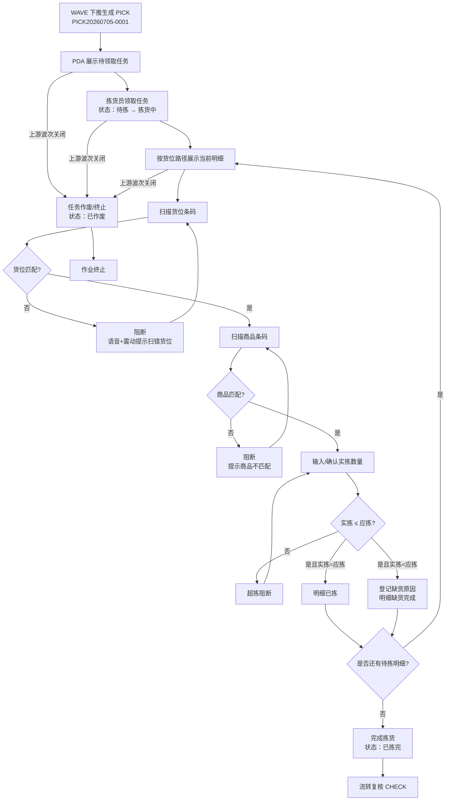
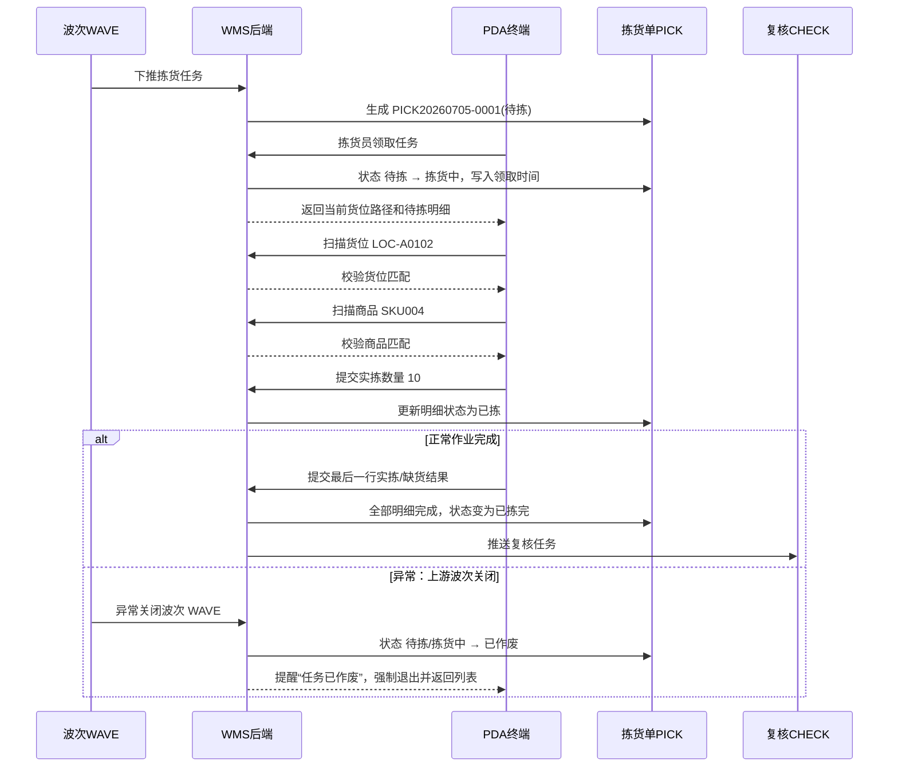

# 拣货单_业务流程推演

> 角色：业务流程推演 | 类型：执行作业单
> 使用 2026 年示例数据，推演 PDA 领任务、扫货位、扫商品、确认拣货的全过程。

## 1. 沙盘数据

| 项 | 值 |
|:--|:--|
| 来源波次 | WAVE20260705-0001 |
| 拣货单号 | PICK20260705-0001 |
| 仓库 | 上海一仓 |
| 拣货员 | 拣货员-赵磊 |
| 拣货模式 | 边拣边分 |
| 领取时间 | 2026-07-05 09:10:00 |

### 1.1 拣货明细

| 行 | 货位 | 货位条码 | SKU | 商品 | 应拣数 | 单位 |
|:--:|:--|:--|:--|:--|--:|:--|
| 1 | A-01-02 | LOC-A0102 | SKU004 | 得力多功能计算器 | 10 | 台 |
| 2 | A-01-05 | LOC-A0105 | SKU002 | 晨光按动式中性笔黑色 | 8 | 支 |

## 2. 业务流程图

## 3. 系统时序图

## 4. 主流程步骤

| 步骤 | 角色 | 输入 | 系统处理 | 输出 |
|:--:|:--|:--|:--|:--|
| 1 | WAVE | 波次明细和拣货员 | 下推生成 PICK | PICK 待拣 |
| 2 | 拣货员 | PDA 领取任务 | 校验用户与任务 | PICK 拣货中 |
| 3 | PDA | 扫描货位 | 校验推荐货位 | 允许扫商品或阻断 |
| 4 | PDA | 扫描商品 | 校验当前 SKU | 允许录数量或阻断 |
| 5 | PDA | 实拣数量 | 校验数量范围 | 明细已拣或进入缺货登记 |
| 6 | PDA | 缺货原因 | 记录缺货数量和原因 | 明细缺货完成 |
| 7 | WMS | 明细完成状态 | 判断全部完成 | PICK 已拣完 |
| 8 | WMS | PICK 完成结果 | 流转复核 | CHECK 待复核 |

## 5. 示例推演

### 5.1 第一行正常拣货

| 项 | 值 |
|:--|:--|
| 推荐货位 | A-01-02 |
| 实扫货位 | LOC-A0102 |
| 应拣 SKU | SKU004 |
| 实扫商品 | SKU004 |
| 应拣数量 | 10 |
| 实拣数量 | 10 |
| 结果 | 明细状态=已拣 |

### 5.2 第二行缺货

| 项 | 值 |
|:--|:--|
| 推荐货位 | A-01-05 |
| 实扫货位 | LOC-A0105 |
| 应拣 SKU | SKU002 |
| 实扫商品 | SKU002 |
| 应拣数量 | 8 |
| 实拣数量 | 6 |
| 缺货数量 | 2 |
| 缺货原因 | 库存不足 |
| 结果 | 明细状态=缺货完成，PICK 带异常标记 |

## 6. 异常流程

### 6.1 扫错货位

- 条件：当前应扫 `LOC-A0102`，PDA 实扫 `LOC-A0103`。
- 处理：阻断确认，提示“货位不匹配，请扫描 A-01-02”，并语音+震动。
- 结果：明细保持待拣或拣货中，不记录实拣数量。

### 6.2 扫错商品

- 条件：当前应拣 `SKU004`，实扫 `SKU002`。
- 处理：阻断确认，提示“商品不匹配，请核对商品”。
- 结果：不能录入该行实拣数量。

### 6.3 超拣

- 条件：应拣 10 件，实拣录入 11 件。
- 处理：阻断确认，提示“实拣数量不能大于应拣数量”。
- 结果：明细不完成，需改回 10 或更少。

### 6.4 缺货

- 条件：应拣 8 件，实拣 6 件。
- 处理：要求选择缺货原因，系统计算缺货 2 件。
- 结果：明细缺货完成，PICK 可在全部明细处理后变为已拣完，但带异常标记流转复核。

## 7. 流程边界

- PICK 不提供新增入口，只由 WAVE 下推生成。
- PICK 完成不扣减现存、不释放占用、不生成 FL；包装完成才触发库存扣减（现存-N、释放占用-N）。
- PICK 不执行复核、包装、交运，只把实拣结果传递给 CHECK。
