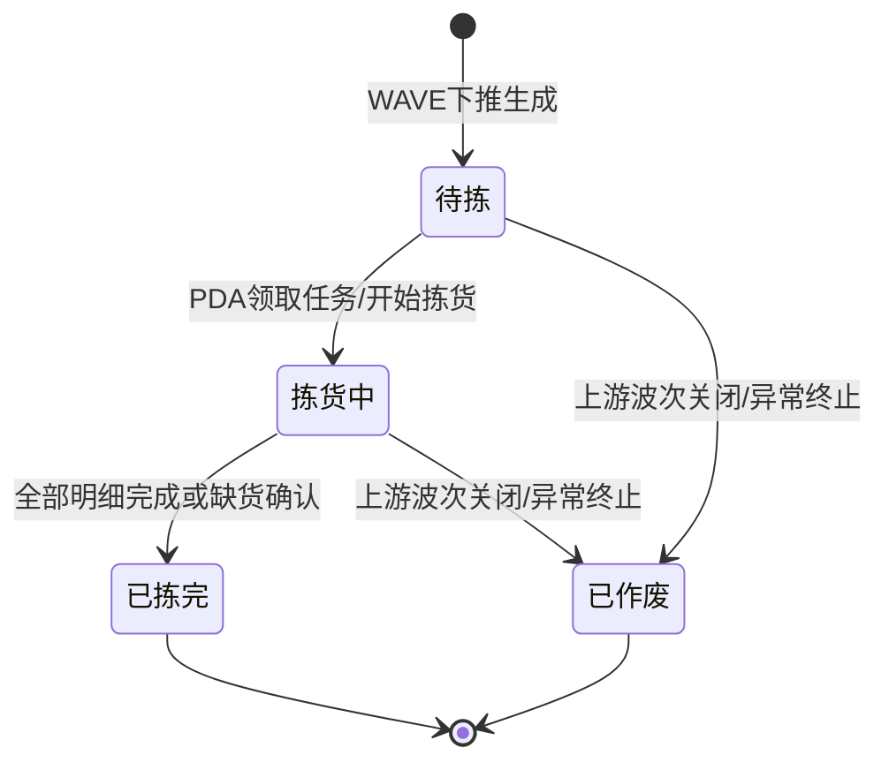

# 拣货单主PRD

> 角色：主PRD | 类型：执行作业单
> 权威层级：context/ > 出库管理主PRD > 波次套件 > 本文件
> 关联文件：`拣货单字段清单.md` `拣货单_业务规则规格.md` `拣货单_业务流程推演.md` `拣货单_用例数据推演.md`

## 1. 业务背景

拣货单（PICK）是 Forge WMS 出库执行层作业单，来源于上游波次（WAVE）下推。拣货员通过 PDA 按波次领取任务，系统按货位路径展示应拣商品，现场执行“扫描货位 → 扫描商品 → 输入/确认实拣数量 → 提交”的动作。

在日均 20,000+ 单、6 个仓库并行作业的出库场景中，拣货是最容易发生漏拣、错拣、超拣和路径低效的环节。拣货单的目标是把波次组织好的订单转换为可执行、可校验、可追踪的 PDA 作业任务，为后续复核、包装、交运提供准确的实拣结果。

## 2. 功能范围

### 2.1 In Scope

| 功能 | 端 | 说明 |
|:--|:--|:--|
| 波次下推生成 PICK | 系统 | 只能由 WAVE 下推生成，不提供手工新增入口 |
| PDA 领取任务 | PDA | 拣货员领取分配给自己的拣货任务 |
| 货位路径拣货 | PDA | 按推荐货位路径展示待拣明细 |
| 扫描货位校验 | PDA | 扫描货位条码，校验是否为当前应拣货位 |
| 扫描商品校验 | PDA | 扫描商品条码，校验是否为当前应拣 SKU |
| 确认实拣数量 | PDA | 输入/确认实拣数量，拦截超拣 |
| 缺货登记 | PDA | 当前货位无法满足应拣数时登记缺货数量与原因 |
| 拣货完成回写 | 系统 | 所有明细完成或缺货确认后，PICK 状态变为已拣完，流转复核 |
| PC 列表/详情查看 | PC | 查看拣货进度、异常、明细和操作记录 |

### 2.2 Out Scope

- 不提供“新增拣货单”入口，PICK 必须来自上游波次下推。
- 不增加审核流，不出现待审核、已审核、反审核等状态。
- 不在拣货单内处理复核、包装、交运执行细节；这些属于 CHECK、PKG、DSH。
- 不在拣货确认时直接扣减现存库存；库存扣减时点按出库主规则在包装完成触发。
- 不做智能路径算法优化，仅使用波次/货位数据给出的推荐路径。
- 不涉及 PDA 硬件选型和扫码枪驱动。

## 3. 单据定位

| 项 | 说明 |
|:--|:--|
| 单据名称 | 拣货单 |
| 单据编码 | PICK |
| 单号规则 | `PICK{YYYYMMDD}-{4位序号}`，如 `PICK20260705-0001` |
| 上游来源 | 波次单 WAVE 下推生成 |
| 下游去向 | 复核单 CHECK；复核不通过时可回退拣货重新处理 |
| 业务定位 | 将波次组织的出库需求转换为 PDA 可执行拣货任务，记录应拣、实拣、缺货和扫码校验结果 |
| 生成方式 | WAVE 分配拣货员并下推拣货后系统生成，不允许无来源创建 |

## 4. 业务场景

| # | 场景 | 示例 | 系统处理 |
|:--:|:--|:--|:--|
| 1 | 正常拣货 | 应拣 SKU004 10 台，货位和商品扫描正确，实拣 10 台 | 明细完成，累计进度更新 |
| 2 | 扫错货位 | 当前应扫 A-01-02，误扫 A-01-03 | PDA 报错并语音/震动提示，不允许确认 |
| 3 | 扫错商品 | 当前应拣 SKU004，误扫 SKU002 | PDA 报错阻断，不允许录入数量 |
| 4 | 超拣拦截 | 应拣 10 件，录入实拣 11 件 | 阻断确认，提示实拣数量不能大于应拣数量 |
| 5 | 缺货登记 | 应拣 10 件，实际货位只有 8 件 | 录入实拣 8、缺货 2、缺货原因，明细异常完成 |
| 6 | 复核不通过回退 | 复核发现数量不一致 | 下游 CHECK 回退到 PICK，拣货员重新拣或补拣 |

## 5. 状态机

拣货单是执行层作业单，只保留拣货执行状态，不加审核流。

| 状态 | 含义 | 可执行动作 | 进入条件 |
|:--|:--|:--|:--|
| 待拣 | 已由波次下推，等待拣货员领取或开始作业 | PDA 领取任务、查看详情 | WAVE 下推生成 PICK |
| 拣货中 | 已进入拣货作业 | 扫货位、扫商品、确认数量、登记缺货 | PDA 领取任务或首条明细开始 |
| 已拣完 | 所有明细均已拣货完成或完成缺货登记 | 查看详情、流转复核 | 全部明细达到完成条件 |
| 已作废 | 拣货任务被作废/异常终止 | 查看详情 | 上游波次关闭或任务异常终止 |

## 6. 规则摘要

| # | 规则 | 摘要 |
|:--:|:--|:--|
| R1 | 来源必需 | PICK 必须由 WAVE 下推生成，不允许手工新增 |
| R2 | 单号不可编辑 | PICK 单号按 `PICK{YYYYMMDD}-{4位序号}` 系统生成 |
| R3 | 状态按钮触发 | 状态由“领取任务/开始拣货/完成拣货”等动作触发，不允许直接编辑 |
| R4 | 扫货位校验 | 扫描货位必须匹配当前任务推荐货位或允许货位 |
| R5 | 扫商品校验 | 扫描商品必须匹配当前明细 SKU |
| R6 | 超拣拦截 | 实拣数量不得大于应拣数量，超拣 PDA 报错阻断 |
| R7 | 缺货登记 | 实拣少于应拣时必须登记缺货数量和原因 |
| R8 | 库存过账 | 拣货确认仅锁定占用，不扣减现存；包装完成才扣减现存及释放占用并生成 FL |
| R9 | 下游边界 | PICK 完成后进入复核；复核、包装、交运细节不写入 PICK |

## 7. 字段清单入口

字段的唯一事实来源见 `拣货单字段清单.md`。本主 PRD 只保留字段分类摘要：

| 分类 | 核心字段 |
|:--|:--|
| 拣货头 | 拣货单号、来源波次、仓库、拣货员、拣货模式、状态、应拣总数、实拣总数、缺货总数 |
| 拣货明细 | 货位、商品、应拣数、实拣数、缺货数、扫描货位、扫描商品、明细状态 |
| 系统字段 | 创建人、创建时间、领取时间、开始时间、完成时间、关联复核单、操作记录 |

## 8. 验收标准

| # | 验收项 | 验收标准 |
|:--:|:--|:--|
| AC1 | 来源控制 | 系统不提供新增入口，PICK 只能由 WAVE 下推生成 |
| AC2 | 单号规则 | PICK 单号符合 `PICK{YYYYMMDD}-{4位序号}`，每日递增 |
| AC3 | 状态流转 | 待拣 → 拣货中 → 已拣完，只能通过动作按钮/扫码确认触发 |
| AC4 | 货位校验 | 扫错货位时 PDA 阻断确认并提示 |
| AC5 | 商品校验 | 扫错商品时 PDA 阻断确认并提示 |
| AC6 | 超拣拦截 | 实拣数量大于应拣数量时阻断 |
| AC7 | 缺货处理 | 实拣小于应拣时必须填写缺货原因，记录缺货数量 |
| AC8 | 库存口径 | 拣货完成不扣减现存、不生成 FL；包装完成才扣减现存、释放占用及生成 FL |
| AC9 | 页面规范 | PDA 大字体、大按钮、扫码优先、关键操作语音+震动反馈 |

## 9. 不确定性

- 缺货后是否自动释放占用、是否拆分订单或触发补货，context 未明确。本文只要求 PICK 记录缺货数量和原因，并把异常交给后续复核/订单处理规则。
