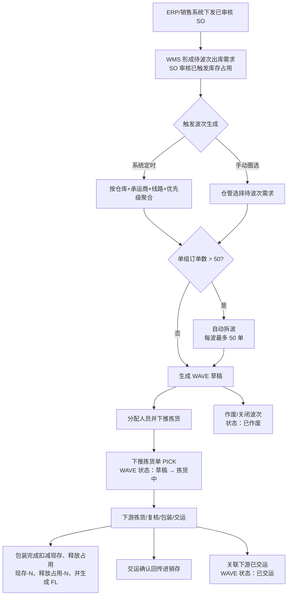
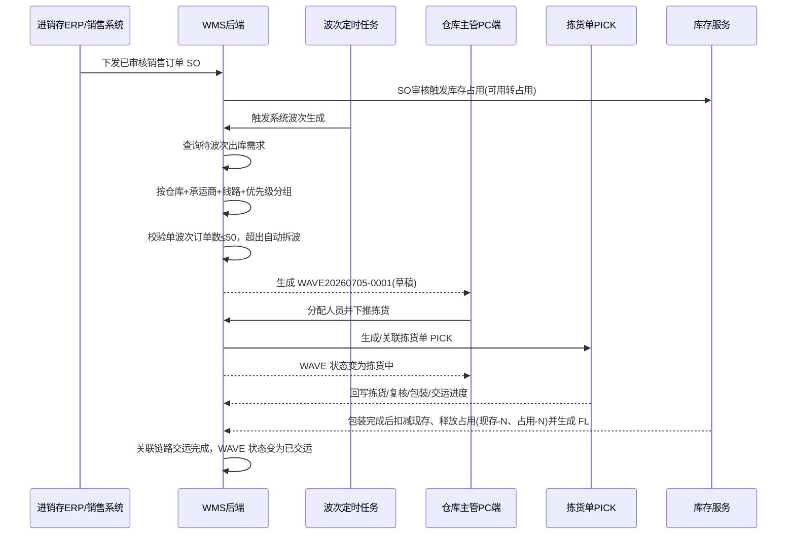

# 波次_业务流程推演

> 角色：业务流程推演 | 类型：业务单据
> 使用 2026 年示例数据，推演一个系统波次聚合 N 个出库需求并下推拣货的全过程。

## 1. 动态沙盘数据

| 项 | 值 |
|:--|:--|
| 波次单号 | WAVE20260705-0001 |
| 波次类型 | 系统波次 |
| 仓库 | 上海一仓 |
| 承运商 | 顺丰速运 |
| 线路 | 上海-浦东线 |
| 发货优先级 | 普通 |
| 拣货模式 | 边拣边分 |
| 拣货员 | 拣货员-赵磊 |
| 触发时间 | 2026-07-05 09:00:00 |

### 1.1 待聚合出库需求

| 出库需求 | SO 行 | 收货区域 | SKU | 商品 | 订单数量 | 已占用数量 | 承运商 | 线路 | 优先级 |
|:--|:--:|:--|:--|:--|--:|--:|:--|:--|:--|
| SO20260705-0101 | 1 | 浦东新区 | SKU004 | 得力多功能计算器 | 6 | 6 | 顺丰速运 | 上海-浦东线 | 普通 |
| SO20260705-0102 | 1 | 浦东新区 | SKU004 | 得力多功能计算器 | 4 | 4 | 顺丰速运 | 上海-浦东线 | 普通 |
| SO20260705-0103 | 1 | 浦东新区 | SKU002 | 晨光按动式中性笔黑色 | 8 | 8 | 顺丰速运 | 上海-浦东线 | 普通 |

## 2. 业务流程图

## 3. 系统时序图

## 4. 主流程步骤

| 步骤 | 角色 | 输入 | 系统处理 | 输出 |
|:--:|:--|:--|:--|:--|
| 1 | ERP/销售系统 | 已审核 SO | 下发销售订单到 WMS | 待出库需求 |
| 2 | WMS | SO 明细 | 按 SO 审核规则占用库存 | 库存占用数量 |
| 3 | 波次任务 | 待波次需求 | 按仓库、承运商、线路、优先级聚合 | 候选波次组 |
| 4 | WMS | 候选波次组 | 校验 50 单上限，必要时拆波 | WAVE 草稿 |
| 5 | 仓库主管 | 拣货员 | 分配人员，下推 PICK | WAVE 拣货中 |
| 6 | 下游单据 | PICK/CHECK/PKG/DSH 结果 | 回写关联进度 | 波次进度更新 |
| 7 | 系统 | 包装完成事件 | 扣减现存、释放占用，并生成 FL | 库存流水 |
| 8 | 系统 | 关联链路完成 | WAVE 状态变为已交运 | 终态 |

## 5. 示例推演

### 5.1 聚合前

| 指标 | 值 |
|:--|--:|
| 待波次订单数 | 3 |
| 待波次 SKU 数 | 2 |
| 待波次数量 | 18 |
| 已占用数量 | 18 |

### 5.2 生成波次

系统按聚合键 `上海一仓 + 顺丰速运 + 上海-浦东线 + 普通` 命中 3 个出库需求，订单数未超过 50，因此生成一个波次：`WAVE20260705-0001`。

| 波次单号 | 订单数 | SKU 数 | 总件数 | 状态 |
|:--|--:|--:|--:|:--|
| WAVE20260705-0001 | 3 | 2 | 18 | 草稿 |

### 5.3 下推拣货

仓库主管分配拣货员-赵磊并点击“下推拣货”，系统生成/关联 `PICK20260705-0001`，波次状态变为拣货中。

### 5.4 下游完成

拣货、复核、包装、交运由下游单据完成。包装完成时扣减库存并生成 FL；交运确认后回传进销存。波次只接收完成回写并更新为已交运。

## 6. 异常流程

### 6.1 超过 50 单自动拆波

- 条件：同一聚合键下有 126 单。
- 处理：自动生成 3 个波次，分别包含 50、50、26 单。
- 结果：每个波次单号独立递增，均为草稿。

### 6.2 手动波次选中无效需求

- 条件：用户圈选已取消或已在其他未完成波次中的出库需求。
- 处理：阻断生成，并在明细行提示原因。
- 结果：无效需求不进入波次。

### 6.3 波次作废/关闭

- 条件：草稿状态波次因线路异常无法执行。
- 处理：仓库主管点击关闭，二次确认并填写关闭原因。
- 结果：波次状态变为已作废；库存释放不由波次作废自动决定，按订单取消/下游单据规则处理。

## 7. 流程边界

- 波次生成不扣减库存，不生成 FL。
- 波次不处理 PDA 扫货位、扫商品、确认拣货量；这些属于 PICK。
- 波次不处理复核不通过、称重、贴面单、交运交接；这些属于 CHECK、PKG、DSH。
