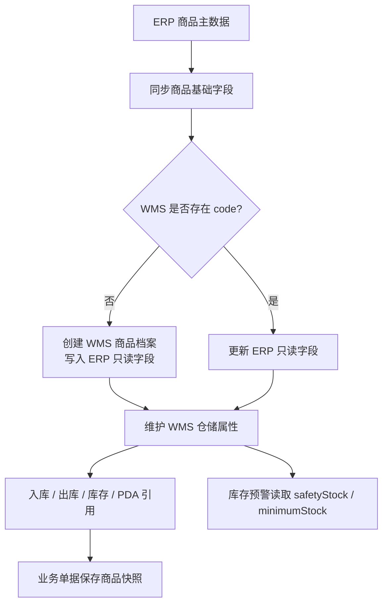
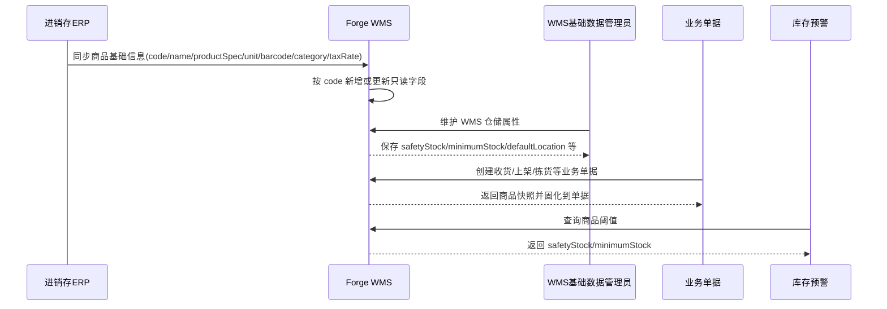
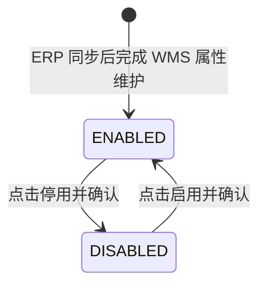

# 商品档案主PRD

> 版本：V1.0 | 更新时间：2026-07-07
> 读者：研发、测试、产品复核
> 文档定位：商品档案是 WMS 商品主数据的 SSOT，本文定义业务边界、同步机制、维护规则与验收口径。字段明细以《商品档案字段清单》为唯一来源。

---

## 1. 业务背景

Forge WMS 的商品档案承接进销存 ERP 的商品主数据，并在 WMS 侧补充仓储作业所需属性。ERP 负责统一商品编码、名称、规格、单位、条码、分类、税率等基础信息；WMS 负责维护安全库存、最低库存、默认货位、体积、重量、是否批次管理、WMS 启停用状态等仓储属性。

商品档案是收货、上架、拣货、库存查询、库存预警、盘点、调拨等模块的关键上游：

- 收货单、上架单、拣货单、复核单等业务单据需要固化商品编码、名称、规格、单位、条码等商品快照。
- 库存预警按商品档案中的 `safetyStock`、`minimumStock` 判断低于安全库存或最低库存。
- PDA 收货、上架、拣货、复核扫描商品条码时，需要按商品档案校验商品是否存在、启用且条码匹配。

---

## 2. 功能范围

### 2.1 In Scope

- 接收 ERP 同步的商品基础信息，并在 WMS 商品档案中只读展示。
- 查询商品档案列表、查看商品详情。
- 为已同步商品维护 WMS 仓储属性：安全库存、最低库存、默认货位、体积、重量、是否批次管理、备注。
- WMS 商品启用 / 停用管理；状态变更必须通过动作按钮触发。
- 为入库、出库、库存、盘点、调拨、PDA 作业提供商品引用口径。
- 为库存预警提供 `safetyStock`、`minimumStock` 阈值来源。
- 前端 Demo 使用 Dexie.js 模拟商品档案列表、新增维护、编辑、详情、启停用交互，Mock 数据使用 2026 年。

### 2.2 Out of Scope

- WMS 侧新增或修改 ERP 商品基础信息。
- WMS 侧维护商品分类树、税率、价格、品牌、多单位换算。
- 商品物理删除；主数据不提供删除，统一通过“停用 / 启用”处理。
- 批次、序列号、效期的完整生命周期管理；本期仅在商品档案维护“是否批次管理”标识。
- 自动补货建议、采购建议、预警消息推送。
- 与第三方物流系统、硬件设备的对接。
- 后端接口、数据库表结构、服务端权限的正式实现。

---

## 3. 档案定位

| 项目 | 内容 |
| :--- | :--- |
| 档案类型 | 基础数据主数据；不生成业务单号 |
| 主数据定位 | 商品基础信息由 ERP 维护并同步；WMS 仓储属性由 WMS 维护 |
| 维护主体 | ERP 商品管理员维护基础信息；WMS 基础数据管理员 / 仓储主管维护仓储属性 |
| 上游关系 | 进销存 ERP 同步商品主数据；采购订单 PO、销售订单 SO 下发时也携带商品快照 |
| 下游关系 | 收货、上架、拣货、复核、包装、库存查询、库存预警、盘点、调拨、PDA 扫码均引用商品档案 |
| 状态模型 | `ENABLED` / `DISABLED` |
| 字段 SSOT | 《商品档案字段清单》 |

### 3.1 术语三口径

| 术语 | 口径 | 说明 |
| :--- | :--- | :--- |
| 商品档案 | WMS 中可查询和维护仓储属性的商品主数据视图 | ERP 基础字段只读，WMS 仓储属性可维护 |
| 商品快照 | 单据创建或下推时固化到业务单据中的商品信息 | 商品档案后续变更不影响已有单据 |
| 库存预警阈值 | 商品档案中的 `safetyStock`、`minimumStock` | 库存预警只读引用，不在预警页维护阈值 |

---

## 4. 业务场景

| 场景ID | 场景 | 使用人 / 系统 | 预期结果 |
| :--- | :--- | :--- | :--- |
| S01 | ERP 同步商品基础信息 | 进销存 ERP / WMS | WMS 按商品编码新增或更新只读基础字段 |
| S02 | 补充 WMS 仓储属性 | WMS 基础数据管理员 | 已同步商品维护安全库存、最低库存、默认货位、体积、重量、是否批次管理 |
| S03 | 入库作业引用商品 | 收货员 / PDA / WMS | 收货单、上架单固化商品快照，PDA 扫码校验商品条码 |
| S04 | 出库作业引用商品 | 拣货员 / 复核员 / PDA | 拣货、复核按商品快照和条码校验商品归属 |
| S05 | 库存预警读取阈值 | 库存专员 / WMS | 库存预警读取 `safetyStock`、`minimumStock` 并计算标黄 / 标红 |
| S06 | 商品停用 / 启用 | WMS 基础数据管理员 | 停用商品不进入新业务候选，历史单据和库存仍可追溯 |

---

## 5. 字段清单摘要

| 字段组 | 代表字段 | 维护口径 |
| :--- | :--- | :--- |
| ERP 同步字段 | 商品编码、名称、规格、单位、条码、分类、税率、参考采购价 | ERP 同步，WMS 只读 |
| WMS 仓储属性 | 安全库存、最低库存、默认货位、体积、重量、是否批次管理、状态、备注 | WMS 维护；状态仅按钮触发 |
| 系统字段 | ERP 更新时间、WMS 建档时间、最后修改时间 | 系统生成，只读展示 |

字段类型、必填性、枚举值与校验规则以《商品档案字段清单》为准；主PRD不重复定义。

---

## 6. 同步机制

### 6.1 同步原则

| 规则ID | 规则 |
| :--- | :--- |
| SYNC-R01 | ERP 是商品基础信息的上游来源；WMS 不提供商品编码、名称、规格、单位、条码、分类、税率等字段的编辑入口。 |
| SYNC-R02 | ERP 同步商品时，WMS 以商品编码 `code` 作为主键进行新增或更新。 |
| SYNC-R03 | ERP 更新基础字段后，WMS 商品档案只读字段随同步结果更新；已生成业务单据中的商品快照不回写、不联动修改。 |
| SYNC-R04 | WMS 仓储属性不被 ERP 同步覆盖，包括 `safetyStock`、`minimumStock`、`defaultLocationCode`、`volume`、`weight`、`batchManaged`、`status`、`remark`。 |
| SYNC-R05 | ERP 未明确“删除商品”同步口径；WMS 不做物理删除。如 ERP 后续传入停售 / 停用状态，需产品复核后决定是否映射到 WMS `status`。 |
| SYNC-R06 | 数据冲突时，基础信息以 ERP 同步结果为准，仓储属性以 WMS 维护结果为准。 |

### 6.2 同步流程图

### 6.3 系统时序图

---

## 7. 维护规则

### 7.1 新增维护规则

| 规则ID | 规则 |
| :--- | :--- |
| PROD-R01 | WMS 不允许手工创建 ERP 商品基础字段；新增页用于给已同步商品补充 WMS 仓储属性。 |
| PROD-R02 | 新增维护时必须先选择一个已同步且未维护仓储属性的商品，商品编码、名称、规格、单位、条码、分类、税率自动带出且只读。 |
| PROD-R03 | WMS 仓储属性保存后，商品进入商品档案列表；新增默认状态为 `ENABLED`。 |
| PROD-R04 | 新增页不提供状态下拉，状态只能通过列表页或详情页动作按钮变更。 |

### 7.2 编辑规则

| 规则ID | 规则 |
| :--- | :--- |
| PROD-R11 | 编辑页展示 ERP 同步字段，但全部只读，不允许前端提供可编辑输入框。 |
| PROD-R12 | 安全库存、最低库存、默认货位、体积、重量、是否批次管理、备注允许 WMS 维护。 |
| PROD-R13 | `safetyStock`、`minimumStock` 填写时必须为非负整数；两者同时填写时必须满足 `minimumStock <= safetyStock`。 |
| PROD-R14 | `defaultLocationCode` 必须来源于货位档案；停用货位不允许作为新的默认货位。 |
| PROD-R15 | 商品档案编辑不影响已有收货单、上架单、拣货单、库存流水、盘点单、调拨单中的商品快照。 |

### 7.3 状态机

| 当前状态 | 可用动作 | 动作后状态 | 规则 |
| :--- | :--- | :--- | :--- |
| `ENABLED` | 停用 | `DISABLED` | 停用后不可被新建 WMS 业务单据、PDA 作业选择；历史数据仍可查询 |
| `DISABLED` | 启用 | `ENABLED` | 启用后重新进入新业务候选范围 |

### 7.4 停用与启用规则

- 停用 / 启用必须由动作按钮触发，并弹出二次确认。
- 商品档案不提供删除入口，不做物理删除。
- 停用商品不进入新建收货、上架、拣货、盘点、调拨等业务候选范围。
- 停用商品仍允许在历史单据、库存查询、库存流水中展示，并明确状态。
- 状态字段不允许在新增 / 编辑表单中直接修改。
- 按通用规范，按钮不可用时隐藏，不展示灰色 disabled 态。

### 7.5 引用与快照规则

| 引用方 | 引用方式 | 规则 |
| :--- | :--- | :--- |
| 收货单 RCV | 继承 PO 商品明细 | 固化商品编码、名称、规格、单位、条码等快照；实收、质检数量由收货单维护 |
| 上架单 PUT | 继承 RCV 商品明细 | 固化商品快照；默认货位可作为推荐货位参考，不替代 PDA 实扫货位 |
| 拣货单 PICK | 来源波次 / 销售订单明细 | 固化商品快照；PDA 扫商品条码需校验商品归属 |
| 库存查询 | 查询维度 | 按商品编码、名称、条码、批次等维度查询库存；商品基础信息使用库存或单据快照展示 |
| 库存预警 | 阈值来源 | 读取商品档案 `safetyStock`、`minimumStock`；预警页不维护阈值 |
| 盘点 / 调拨 | 商品候选与快照 | 新建作业只允许选择 `ENABLED` 商品；历史作业不受商品停用影响 |

---

## 8. 验收

| 验收ID | 验收项 | 验收标准 |
| :--- | :--- | :--- |
| AC01 | ERP 字段只读 | 商品编码、名称、规格、单位、条码、分类、税率等 ERP 同步字段在新增、编辑页均只读，不允许 WMS 修改 |
| AC02 | WMS 属性可维护 | 安全库存、最低库存、默认货位、体积、重量、是否批次管理、备注可在 WMS 保存并回显 |
| AC03 | 阈值落地 | 商品档案字段清单包含 `safetyStock`、`minimumStock`，库存预警可明确引用 |
| AC04 | 阈值校验 | `minimumStock`、`safetyStock` 填写时必须为非负整数，且 `minimumStock <= safetyStock` |
| AC05 | 状态按钮驱动 | 状态不能通过表单下拉直接修改，只能点击“停用”或“启用”按钮触发 |
| AC06 | 无物理删除 | 列表、详情、表单均不提供删除入口 |
| AC07 | 停用引用限制 | 停用商品不进入新建收货、上架、拣货、盘点、调拨、PDA 作业候选范围 |
| AC08 | 历史快照不变 | 商品档案变更后，已有业务单据中的商品名称、规格、单位、条码等快照不被改写 |
| AC09 | 默认货位校验 | 默认货位必须来源于启用货位档案；停用货位不可被新维护为默认货位 |
| AC10 | Demo 数据 | Mock 商品日期使用 2026 年，列表筛选、新增维护、编辑、详情、启停用后数据可刷新展示 |

---

## 9. 不确定性说明

| 事项 | 当前处理 | 需复核点 |
| :--- | :--- | :--- |
| 税率字段 | 用户要求列入 ERP 同步字段，WMS 只读展示 | context 与当前 WMS Demo 未定义税率来源、必填性和精度，需以 ERP 接口为准 |
| 商品分类枚举 | 按 ERP 同步文本 / 枚举只读展示 | context 未定义分类树或分类枚举 |
| 安全 / 最低库存维度 | 当前按商品档案全局阈值处理 | 是否需要按仓库 + 商品配置阈值，context 未明确 |
| 默认货位维度 | 当前按商品维护一个默认货位，Demo 仅作推荐参考 | 多仓场景是否应扩展为按仓库维护默认货位，context 未明确 |
| 体积 / 重量单位 | 字段落地，但单位未在 context 明确 | 需产品复核使用 cm3 / kg 还是其他单位 |
| ERP 停用映射 | 当前 WMS `status` 由 WMS 按按钮维护 | ERP 停售 / 停用是否自动影响 WMS 状态，context 未明确 |
