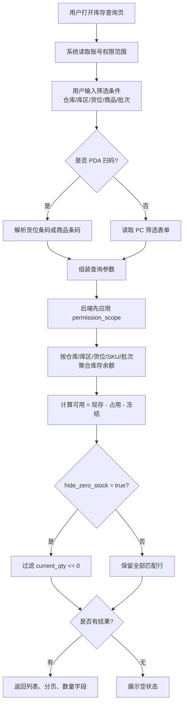
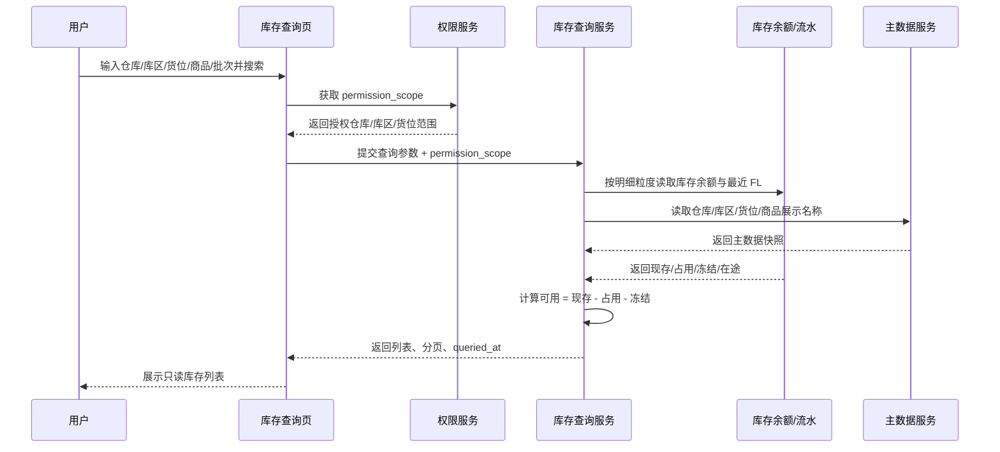

# 库存查询_业务流程推演

> 状态：已补全
> 角色：业务流程推演 | 类型：查询页
> 覆盖场景：PC 多维筛选、PDA 扫码查询、冻结/在途展示、空结果
> 说明：本流程只读查询库存，不触发库存变动，不生成库存流水。

## 1. 2026 示例数据沙盘

### 1.1 主数据

| 对象 | 编码 | 名称 | 说明 |
|:--|:--|:--|:--|
| 仓库 | WH-SH-01 | 上海一仓 | 授权给仓管员陈明 |
| 库区 | ZN-SH-STO | 存储区 | 属于上海一仓 |
| 库区 | ZN-SH-QC | 质检区 | 属于上海一仓 |
| 货位 | LOC-A0102 | A-01-02 | 存储货位 |
| 货位 | LOC-A0103 | A-01-03 | 存储货位 |
| 货位 | LOC-QC01 | QC-01 | 质检暂存货位 |
| 商品 | SKU003 | 强盛定制纯木浆A4复印纸 | 单位：包 |
| 商品 | SKU001 | 双鸭牌标准型回形针 | 单位：盒 |

### 1.2 库存余额沙盘

| 仓库 | 库区 | 货位 | SKU | 批次 | 现存 | 占用 | 冻结 | 可用 | 在途 | 最近流水 |
|:--|:--|:--|:--|:--|--:|--:|--:|--:|--:|:--|
| WH-SH-01 | ZN-SH-STO | LOC-A0102 | SKU003 | B20260705-A | 120 | 30 | 10 | 80 | 0 | FL20260705-00000002 |
| WH-SH-01 | ZN-SH-STO | LOC-A0103 | SKU003 | B20260705-A | 60 | 20 | 0 | 40 | 0 | FL20260705-00000003 |
| WH-SH-01 | ZN-SH-QC | LOC-QC01 | SKU001 | B20260705-QC | 45 | 0 | 45 | 0 | 0 | FL20260705-00000004 |
| WH-SH-01 | ZN-SH-STO | LOC-A0102 | SKU001 | B20260706-T | 0 | 0 | 0 | 0 | 30 | FL20260706-00000011 |

校验：第一行 `可用 = 120 - 30 - 10 = 80`；第三行 `可用 = 45 - 0 - 45 = 0`。在途数量 30 来自调拨途中，不参与可用公式。

## 2. 业务流程图

## 3. 系统时序图

## 4. 场景推演

### 4.1 场景 A：PC 按仓库 + 库区 + 商品查询

| 步骤 | 操作 | 系统处理 | 结果 |
|:--|:--|:--|:--|
| 1 | 用户选择 `WH-SH-01`、`ZN-SH-STO`、商品 `SKU003` | 后端先校验仓库授权，再按条件过滤 | 命中 2 行 |
| 2 | 系统按货位和批次拆行 | `LOC-A0102`、`LOC-A0103` 分别展示 | 不做跨货位合并 |
| 3 | 系统校验公式 | 第一行 120-30-10=80；第二行 60-20-0=40 | 可用列展示 80、40 |

### 4.2 场景 B：PDA 扫货位查询

| 步骤 | 操作 | 系统处理 | 结果 |
|:--|:--|:--|:--|
| 1 | 仓管员 PDA 扫描货位条码 `LOC-A0102` | 解析为货位 `A-01-02` | 自动带入货位条件 |
| 2 | 点击查询 | 过滤该货位下库存 | 返回 `SKU003` 与 `SKU001` 两行 |
| 3 | 查看三口径 | 同屏展示现存、占用、可用 | `SKU003` 可用 80；`SKU001` 可用 0 |

### 4.3 场景 C：查看冻结库存

| 步骤 | 操作 | 系统处理 | 结果 |
|:--|:--|:--|:--|
| 1 | 用户筛选库区 `ZN-SH-QC` | 查询质检区库存 | 命中 `SKU001` |
| 2 | 系统读取冻结量 45 | 按公式计算 `45 - 0 - 45` | 可用展示 0 |
| 3 | 用户复核 | 页面只读展示冻结原因口径 | 不提供解冻按钮 |

### 4.4 场景 D：查看在途库存

| 步骤 | 操作 | 系统处理 | 结果 |
|:--|:--|:--|:--|
| 1 | 调拨单 `TR20260706-0001` 已调出确认，调入未确认（北京一仓待收） | 调拨途中数量形成在途 | `SKU004` 在途 100 |
| 2 | 用户查询北京一仓商品 `SKU004` | 列表展示现存 200、在途 100 | 可用仍为 180 |
| 3 | 用户复核 | 页面说明在途不参与可用公式 | 不提供调入确认入口 |

### 4.5 场景 E：空结果

| 步骤 | 操作 | 系统处理 | 结果 |
|:--|:--|:--|:--|
| 1 | 用户输入批次 `NOT-EXIST-2026` | 后端按权限 + 条件查询 | 返回 0 行 |
| 2 | 页面渲染 | 列表区展示空状态 | 汇总数量均为 0 |

## 5. 关键约束复核

- 查询页不生成 `FL`，只有库存变动动作才生成库存流水。
- 查询页不改变库存状态，只展示现存、占用、可用、冻结、在途。
- 查询页无状态机、无状态 Tab、无新增/编辑/详情页。
- 所有示例流水号遵守 `FL{YYYYMMDD}-{8位序号}`；调拨单示例遵守 `TR{YYYYMMDD}-{4位序号}`。
