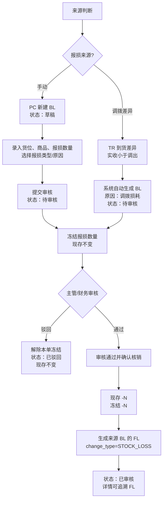
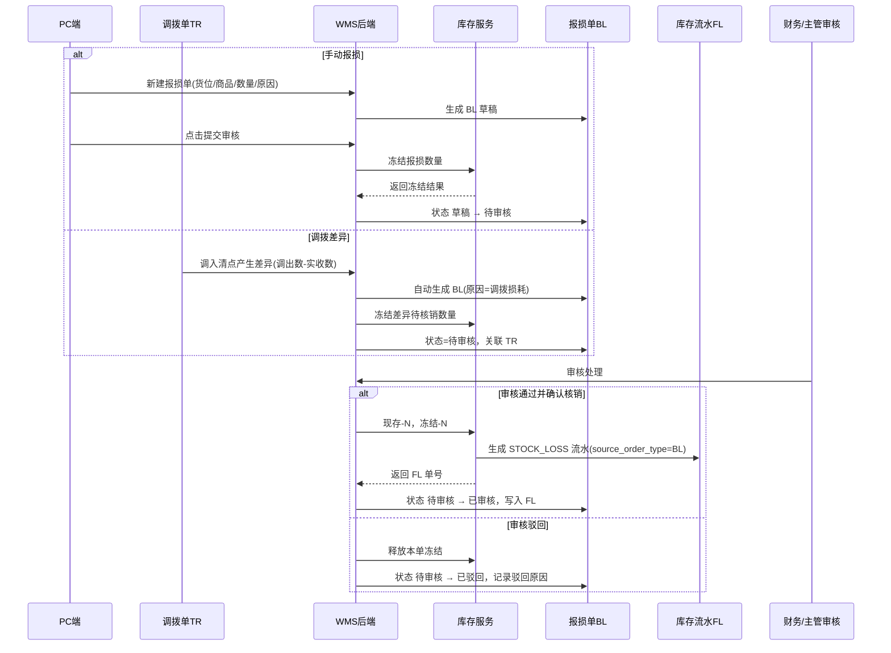

# 报损单_业务流程推演

> 角色：业务流程推演 | 类型：业务单据类
> 使用 2026 年示例数据，推演手动报损、调拨差异自动生成、审核核销、驳回和 FL 追溯全过程。

## 1. 沙盘数据

| 项 | 值 |
|:--|:--|
| 手动报损单 | BL20260706-0001 |
| 调拨损耗报损单 | BL20260706-0002 |
| 关联调拨单 | TR20260706-0002 |
| 仓库 | WH-SH-01 上海一仓、WH-CD-01 成都仓 |
| 审核人 | U-MGR-001 仓库主管-李娜 |
| 财务复核角色 | U-FIN-002 财务-周敏 |
| Mock 日期 | 2026-07-06 |

## 2. 业务流程图

## 3. 系统时序图

## 4. 主流程步骤

| 步骤 | 角色 | 输入 | 系统处理 | 输出 |
|:--:|:--|:--|:--|:--|
| 1 | 仓管员 | 货位、商品、数量、原因 | 创建手动 BL 草稿 | `draft` |
| 2 | 仓管员 | 点击提交审核 | 校验字段和可冻结数量 | `pending_review`，冻结数量 |
| 3 | 系统 | TR 到货差异 | 自动生成 BL，原因调拨损耗 | `pending_review`，关联 TR |
| 4 | 审核人 | 审核通过并确认核销 | 扣减现存，释放本单冻结 | `approved`，生成 FL |
| 5 | 审核人 | 审核驳回 | 释放本单冻结 | `rejected`，现存不变 |

## 5. 示例推演：手动报损

| 项 | 值 |
|:--|:--|
| 报损单号 | BL20260706-0001 |
| 来源 | `manual` 手动 |
| 仓库/货位 | WH-SH-01 上海一仓 / A-01-02 |
| SKU | SKU004 得力多功能计算器 |
| 报损类型 | `goods_damage` 货物损坏 |
| 报损原因 | `damaged` 损坏 |
| 报损数量 | 6 |
| 审核动作 | 审核通过并确认核销 |

### 5.1 状态与库存口径

| 时点 | BL 状态 | 现存 | 占用 | 冻结 | 可用 | 说明 |
|:--|:--|--:|--:|--:|--:|:--|
| 创建草稿前 | - | 120 | 20 | 0 | 100 | `120-20-0=100` |
| 保存草稿后 | 草稿 | 120 | 20 | 0 | 100 | 草稿不影响库存 |
| 提交审核后 | 待审核 | 120 | 20 | 6 | 94 | 先冻结报损数量，现存不变 |
| 审核核销后 | 已审核 | 114 | 20 | 0 | 94 | 现存-6，冻结-6，可用按公式重算 |

### 5.2 FL 结果

| 字段 | 值 |
|:--|:--|
| flow_no | FL20260706-00000041 |
| source_order_type | `BL` |
| source_order_no | BL20260706-0001 |
| change_type | `STOCK_LOSS` |
| change_qty | -6 |
| qty_on_hand_after | 114 |

## 6. 示例推演：调拨损耗

| 项 | 值 |
|:--|:--|
| 报损单号 | BL20260706-0002 |
| 来源 | `transfer_diff` 调拨差异 |
| 关联调拨单 | TR20260706-0002 |
| 调出数量 | 80 |
| 实收数量 | 76 |
| 报损数量 | 4 |
| 报损原因 | `transfer_loss` 调拨损耗 |

### 6.1 调拨差异与 BL 生成

| 时点 | TR/BL 状态 | 差异数量 | 处理 |
|:--|:--|--:|:--|
| TR 调入清点 | TR 已调出（在途） | 4 | `80-76=4` |
| 差异确认 | TR 生成 BL | 4 | 调入仓只按 76 入库，系统生成 BL |
| BL 待审核 | BL 待审核 | 4 | 原因固定调拨损耗，等待资产核销审核 |
| BL 已审核 | BL 已审核 | 4 | 审核通过并确认核销，生成来源 BL 的 FL |

### 6.2 差异待核销口径

| 时点 | 现存 | 占用 | 冻结 | 可用 | 说明 |
|:--|--:|--:|--:|--:|:--|
| BL 生成前 | 4 | 0 | 0 | 4 | 差异待核销数量，用于资产核销审批展示 |
| BL 待审核 | 4 | 0 | 4 | 0 | 调拨损耗待审核期间不可用 |
| BL 已审核 | 0 | 0 | 0 | 0 | 核销后现存-4，生成 FL |

> 不确定性：context/08 只说明调入仓按实收入库并生成 BL，未展开差异数量在 BL 审核前映射为冻结现存还是在途待核销。本表按二期 Demo 的资产核销展示口径推演，正式实现需与 TR 在途清零口径统一，避免重复扣减。

## 7. 异常流程

### 7.1 审核驳回

- 条件：BL20260706-0003 待审核，审核人发现报损数量与现场照片不一致。
- 处理：审核人点击“审核驳回”，填写驳回原因。
- 结果：BL 状态变为已驳回，释放本单冻结，现存不变。

### 7.2 报损数量超过可用

- 条件：现存 30，占用 10，冻结 5，可用 15；用户提交报损 20。
- 处理：提交审核时阻断。
- 结果：BL 保持草稿，库存不变，提示“可报损库存不足”。

### 7.3 重复核销

- 条件：BL 已审核，网络重试再次提交核销请求。
- 处理：系统按 `source_order_type + source_line_id + change_type` 幂等校验。
- 结果：不重复扣现存，不重复生成 FL。

## 8. 流程边界

- BL 内完成审核和核销，不拆独立资产核销单。
- 草稿、待审核不扣减现存；待审核只冻结报损数量。
- 已审核才扣减现存并生成来源 BL 的库存流水。
- 调拨差异 BL 的原因固定为调拨损耗，不允许改成手动原因。
- 已审核、已驳回后单据只读，不允许删除。

