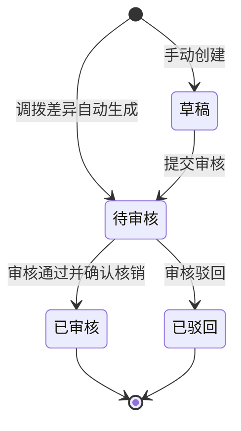

# 报损单_业务规则规格

> 角色：业务规则规格 | 类型：业务单据类
> 覆盖报损单状态机、两类来源、冻结控制、审核核销、FL 生成、权限和异常边界。

## 1. 状态机

| 当前状态 | 动作 | 目标状态 | 触发端 | 前置条件 | 后置结果 |
|:--|:--|:--|:--|:--|:--|
| - | 手动创建 | 草稿 | PC | 用户有创建权限 | 生成 BL 草稿，不冻结、不扣现存 |
| 草稿 | 保存草稿 | 草稿 | PC | 基础字段校验通过 | 更新草稿，不变更库存 |
| 草稿 | 提交审核 | 待审核 | PC/系统 | 必填、数量和可冻结校验通过 | 冻结报损数量，写入提交时间 |
| - | 调拨差异自动生成 | 待审核 | 系统 | TR 存在实收<调出差异 | 生成 BL，原因=调拨损耗，锁定差异待核销数量 |
| 待审核 | 审核通过并确认核销 | 已审核 | PC/系统 | 审核权限、冻结/差异待核销存在、未重复核销 | 手动报损现存 -N；调拨损耗差异待核销 -N；生成来源 BL 的 FL |
| 待审核 | 审核驳回 | 已驳回 | PC/系统 | 审核权限、驳回原因必填 | 解除本单冻结，现存不变 |

## 2. 动作按钮规则

| 按钮/动作 | 展示状态 | 权限 | 校验 | 说明 |
|:--|:--|:--|:--|:--|
| 新建报损单 | 列表页 | 仓管员/仓库主管 | 有可见仓库权限 | 仅创建手动来源 BL |
| 保存草稿 | 草稿 | 创建人/仓库主管 | 基础字段校验 | 不冻结库存 |
| 提交审核 | 草稿 | 创建人/仓库主管 | 全量字段、数量、可冻结校验 | 进入待审核并冻结 |
| 审核通过并确认核销 | 待审核 | 审核人/主管/财务 | 冻结存在、未重复核销 | 合并审核与核销动作，不拆多级审批 |
| 审核驳回 | 待审核 | 审核人/主管/财务 | 驳回原因必填 | 释放本单冻结 |
| 查看 FL | 已审核 | 有查看权限 | 已有关联 FL | 跳转库存流水 |

按钮不可用时隐藏，不展示灰色 disabled 态。状态字段只读，不允许直接编辑。

## 3. 来源规则

| 编号 | 规则 | 说明 |
|:--|:--|:--|
| SRC-R01 | 手动来源 | `sourceType=MANUAL`，由 PC 新建，允许保存草稿 |
| SRC-R02 | 手动原因 | 手动报损原因可选损坏、过期、其它；其它必须填写说明 |
| SRC-R03 | 调拨差异来源 | `sourceType=TRANSFER_DIFF`，由 TR 到货差异自动生成 |
| SRC-R04 | 调拨损耗原因 | 调拨差异 BL 的 `damageReason` 固定为 `TRANSFER_LOSS` 调拨损耗 |
| SRC-R05 | 关联单号 | 调拨差异 BL 必须记录 TR 单号和来源行 ID |
| SRC-R06 | 自动生成幂等 | 同一 TR 行差异不得重复生成多张有效 BL |

## 4. 报损冻结规则

| 编号 | 规则 | 说明 |
|:--|:--|:--|
| FRZ-R01 | 草稿不冻结 | 手动 BL 草稿只记录申请，不影响现存、占用、冻结、可用 |
| FRZ-R02 | 提交后冻结 | 手动 BL 提交审核后，报损数量进入冻结，现存不变 |
| FRZ-R03 | 自动生成锁定 | 调拨差异自动生成 BL 后直接进入待审核，并按差异数量锁定差异待核销口径 |
| FRZ-R04 | 冻结影响 | 冻结增加导致可用减少；公式仍为 `可用 = 现存 - 占用 - 冻结` |
| FRZ-R05 | 冻结流水 | 库存流水模块已定义报损锁库可生成 `FREEZE`；是否在 BL 页面强制展示独立冻结 FL 待复核 |
| FRZ-R06 | 驳回释放 | 审核驳回时释放本单冻结，现存不变 |

## 5. 审核与核销规则

| 编号 | 规则 | 说明 |
|:--|:--|:--|
| REV-R01 | 必须审核 | 报损涉及资产核销，不能跳过审核直接扣减现存 |
| REV-R02 | 一道审核 | 只保留主管/财务一道审核，不新增多级审批 |
| REV-R03 | 合并动作 | “审核通过并确认核销”是一个动作，成功后状态进入已审核 |
| REV-R04 | 驳回原因 | 审核驳回必须填写原因，便于申请人和财务复核 |
| REV-R05 | 已审核只读 | 已审核后 BL 只读，不允许修改明细和原因 |
| REV-R06 | 已驳回只读 | 已驳回后不允许再次提交；如需重新报损，需新建 BL |

## 6. 库存核销规则

| 编号 | 规则 | 说明 |
|:--|:--|:--|
| INV-R01 | 核销时点 | 只有“审核通过并确认核销”才更新对应库存口径并生成核销 FL |
| INV-R02 | 现存扣减 | 手动报损 `MANUAL` 每条明细按 `damageQty` 扣减现存：现存 `-N`；调拨损耗 `TRANSFER_DIFF` 扣差异待核销，不扣现存 |
| INV-R03 | 冻结扣减 | 本单冻结随核销释放：冻结 `-N` |
| INV-R04 | 占用不变 | 报损核销不修改销售占用口径 |
| INV-R05 | 可用重算 | 可用不手工写入，按 `现存 - 占用 - 冻结` 重算 |
| INV-R06 | FL 类型 | 手动报损核销生成 `changeType=STOCK_LOSS`；调拨损耗核销生成 `changeType=DAMAGE_LOSS`；均为 `sourceOrderType=BL` |
| INV-R07 | 来源追溯 | FL 的来源单号为当前 `blNo`，并保留来源行 ID |
| INV-R08 | 幂等 | 同一 BL 明细只能生成一次有效核销 FL，重复点击必须拦截 |

## 7. 调拨损耗规则

| 编号 | 规则 | 说明 |
|:--|:--|:--|
| TR-BL-R01 | 触发条件 | TR 明细 `actualReceiveQty < transferOutQty` 时生成 BL |
| TR-BL-R02 | 报损数量 | `damageQty = transferOutQty - actualReceiveQty` |
| TR-BL-R03 | 原因固定 | 原因固定为 `TRANSFER_LOSS` 调拨损耗，不允许人工改为其它 |
| TR-BL-R04 | 调入数量 | 调入仓仅按实收数量入库，保持与 `08-调拨流程` 一致 |
| TR-BL-R05 | 资产核销 | 差异数量必须经过 BL 审核后才完成资产核销；核销时扣差异待核销，不动现存 |
| TR-BL-R06 | 防重复扣减 | TR 差异入库已清在途并挂差异待核销，BL 核销不得重复扣减现存；需以幂等键和来源行约束 |

## 8. 权限规则

| 角色 | 权限 | 说明 |
|:--|:--|:--|
| 仓管员 | 新建手动 BL、保存草稿、提交审核、查看本人仓库 BL | 不能审核核销 |
| 仓库主管 | 新建、提交、审核、驳回、查看 FL | 可处理仓库内报损 |
| 财务审核 | 审核、驳回、查看核销结果 | 用于资产核销复核 |
| 只读账号 | 查看列表、详情和 FL | 不能触发状态变化 |
| 系统 | 调拨差异自动生成 BL、写操作日志、生成 FL | 无人工页面入口 |

## 9. 异常和边界

| 场景 | 处理 |
|:--|:--|
| 报损数量为空或 ≤0 | 阻断保存/提交，提示数量必须为正整数 |
| 报损数量超过可报损上限 | 阻断提交，提示可报损库存不足 |
| 其它原因未填写说明 | 阻断提交 |
| 审核人为空 | 阻断提交 |
| 待审核库存冻结失败 | 不允许进入待审核，提示冻结失败原因 |
| 核销 FL 生成失败 | 不进入已审核，库存回滚或保持待审核，提示重试 |
| 重复点击核销 | 返回已处理结果，不重复扣减现存 |
| 调拨差异 BL 生成失败 | TR 差异完成不得静默成功，需提示生成 BL 失败并重试 |

## 10. 完成判定

| 判定项 | 规则 |
|:--|:--|
| 草稿完成 | 必填基础字段可保存，库存不变 |
| 提交完成 | 状态为待审核；手动报损数量已冻结，调拨损耗差异待核销已锁定 |
| 核销完成 | 状态为已审核；手动报损现存 -N，调拨损耗差异待核销 -N；关联 FL 写入 |
| 驳回完成 | 状态为已驳回，本单冻结释放，现存不变 |

## 11. 不确定性

- context 明确报损触发冻结，但未明确冻结发生在创建、提交审核还是审核前。本套件按提交审核/自动生成待审核后冻结处理。
- 库存流水模块包含 `FREEZE`/`UNFREEZE`，本套件强制要求核销时生成来源 BL 的核销 FL；手动报损用 `STOCK_LOSS`，调拨损耗用 `DAMAGE_LOSS`，冻结/解冻 FL 的页面展示强制性待复核。
- 调拨差异场景中，TR 调入确认已清在途并挂差异待核销；BL 审核核销只扣差异待核销，不二次扣现存。
