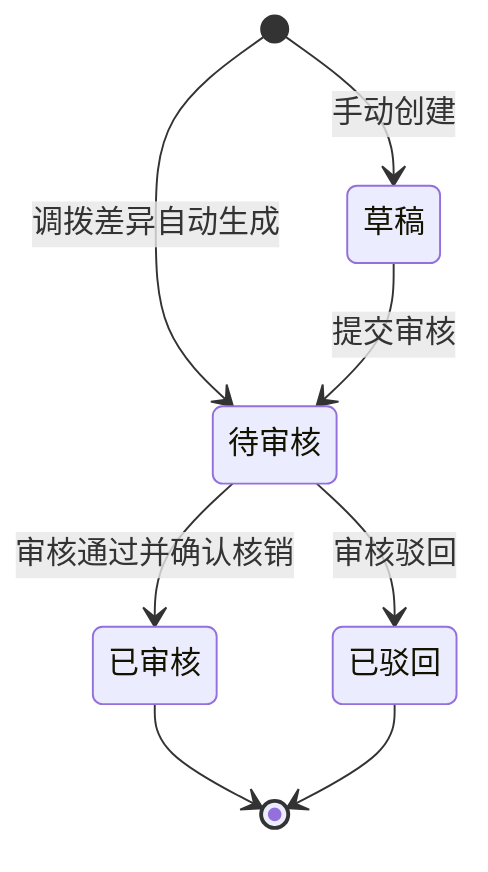

# 报损单主PRD

> 本模块为二期规划。
> 角色：主PRD | 类型：业务单据类
> 权威层级：context/ > 调拨单套件 > 本文件
> 关联文件：`报损单字段清单.md` `报损单_业务规则规格.md` `报损单_业务流程推演.md` `报损单_用例数据推演.md`

## 1. 业务背景

报损单（BL）用于处理仓库内不可继续销售、不可继续出库或调拨到货短少形成的库存报损核销。报损涉及企业资产减少，必须经过合法审核后才能核销库存；草稿、待审核阶段不得直接扣减现存。

Forge WMS 二期在调拨管理中已定义“到货差异自动生成报损单，原因标记为调拨损耗”。因此 BL 需要同时覆盖手动报损和调拨差异自动生成两类来源，形成“报损申请 → 审核 → 确认核销 → 生成库存流水 FL”的闭环。

## 2. 功能范围

### 2.1 一期不做

| 范围 | 说明 |
|:--|:--|
| 报损单 BL | 一期模块清单未包含报损管理，不创建 BL |
| 调拨差异资产核销 | 一期不包含仓间调拨，也不处理调拨损耗核销 |
| 报损审核 | 一期不提供报损主管/财务审核动作 |

### 2.2 二期做

| 功能 | 端 | 说明 |
|:--|:--|:--|
| 手动新建报损单 | PC | 仓库人员针对损坏、过期、其它原因发起报损申请 |
| 调拨差异自动生成 | 系统 | TR 到货差异自动生成 BL，来源=`TRANSFER_DIFF`，原因=`TRANSFER_LOSS` 调拨损耗 |
| 报损期间库存控制 | 系统 | 手动报损提交审核后冻结报损数量；调拨差异自动生成待审核后锁定差异待核销 |
| 一道审核 | PC | 主管或财务审核报损，作为资产核销的合法环节 |
| 确认核销 | PC/系统 | 审核通过并确认核销后，手动报损现存 `-N`；调拨损耗差异待核销 `-N`；生成来源为 BL 的 FL |
| 驳回 | PC | 审核不通过进入已驳回，解除本次报损冻结，库存现存不变 |
| 列表/新增编辑/详情 | PC | 查询状态、维护草稿、查看审核与核销结果 |

### 2.3 不在本次范围

- 不增加多级审批；只保留一道主管/财务审核。
- 不定义财务系统完整凭证接口，仅记录 BL 核销结果可供财务核算追溯。
- 不涉及第三方物流、运输系统或硬件选型。
- 不提供删除报损单入口；已生成 BL 单号不回收。
- 不定义后端实现方案，Demo 仅描述产品页面、交互和 Mock 数据。

## 3. 单据定位

| 项 | 说明 |
|:--|:--|
| 单据名称 | 报损单 |
| 单据编码 | BL |
| 单号规则 | `BL{YYYYMMDD}-{4位序号}`，如 `BL20260706-0001` |
| 来源 | `MANUAL` 手动报损、`TRANSFER_DIFF` 调拨差异 |
| 上游来源 | 手动选择库存；或调拨单 TR 到货差异 |
| 下游去向 | 库存流水 FL；财务核算读取报损核销结果 |
| 业务定位 | 记录报损原因、报损数量、审核结论和库存核销结果 |
| 单据边界 | 审核与核销属于 BL 内部流程，不拆独立核销单 |

## 4. 业务场景

| # | 场景 | 示例 | 系统处理 |
|:--:|:--|:--|:--|
| 1 | 货物损坏手动报损 | 仓库发现 A-01-02 货位 6 件工具箱外箱破损 | 创建 BL 草稿，提交后冻结 6 件，审核通过并确认核销后现存 -6 |
| 2 | 商品过期手动报损 | 临期/过期商品不可销售 | 创建 BL，原因选择过期，审核后核销 |
| 3 | 其它原因手动报损 | context 未覆盖的现场异常 | 原因选择其它并填写说明，审核人复核后处理 |
| 4 | 调拨损耗自动生成 | TR 调出 80 件，调入实收 76 件 | 系统生成 BL，原因固定调拨损耗；待审核后核销差异待核销 4 件，不二次扣现存 |
| 5 | 审核驳回 | 审核发现数量或原因不成立 | BL 进入已驳回，解除本次冻结，现存不变 |

## 5. 状态机

报损审核是资产核销的合法环节，参照盘点单的主管审核写法：只有审核通过并确认核销后，才允许更新库存现存并生成 FL。

| 状态 | 含义 | 可执行动作 | 库存影响 |
|:--|:--|:--|:--|
| 草稿 | 手动创建后尚未提交审核 | 编辑、保存、提交审核 | 不冻结、不扣减现存 |
| 待审核 | 等待主管/财务审核 | 审核通过并确认核销、审核驳回 | 手动报损已冻结报损数量；调拨损耗已锁定差异待核销；现存不变 |
| 已审核 | 已完成资产核销 | 查看详情、查看 FL | 手动报损现存 `-N`；调拨损耗差异待核销 `-N`；生成来源 BL 的 FL |
| 已驳回 | 审核不通过 | 查看详情 | 解除本次报损冻结，现存不变 |

> 状态变更必须通过动作按钮触发，不允许直接编辑状态字段。按钮不可用时隐藏，不展示灰色 disabled 态。

## 6. 字段清单入口

字段的唯一事实来源见 `报损单字段清单.md`。本主 PRD 只保留字段分类摘要：

| 分类 | 核心字段 |
|:--|:--|
| 报损头 | 报损单号、来源、关联单号、报损原因、调出仓、调入仓、申请人、审核人、状态、提交时间、审核时间、核销时间 |
| 报损明细 | 货位、商品、批次、报损数量、当前现存、当前占用、当前冻结、核销后现存 |
| 系统字段 | 创建人、创建时间、更新时间、关联 TR、关联 FL、冻结记录、操作记录 |

## 7. 核心规则摘要

| # | 规则 | 摘要 |
|:--:|:--|:--|
| R1 | 单号规则 | BL 单号按 `BL{YYYYMMDD}-{4位序号}` 系统生成，不可编辑 |
| R2 | 两类来源 | 支持手动报损和调拨差异自动生成 |
| R3 | 调拨损耗 | 调拨差异来源的报损原因固定为 `TRANSFER_LOSS` 调拨损耗，关联 TR |
| R4 | 库存控制 | 手动报损提交审核后冻结报损数量；调拨损耗自动生成待审核后锁定差异待核销 |
| R5 | 审核必经 | 报损涉及资产核销，必须经一道主管/财务审核 |
| R6 | 核销时点 | 仅“审核通过并确认核销”后生成来源 BL 的 FL；手动报损现存 `-N`，调拨损耗差异待核销 `-N` |
| R7 | 驳回 | 驳回不扣减现存，并解除本次报损冻结 |
| R8 | 库存口径 | 可用 = 现存 - 占用 - 冻结；草稿/待审核不扣现存；手动报损核销后现存减少，调拨损耗核销后现存不变、差异待核销减少 |

## 8. 验收标准

| # | 验收项 | 验收标准 |
|:--:|:--|:--|
| AC1 | 二期标识 | 主 PRD 顶部明确标注“本模块为二期规划” |
| AC2 | 文件套件 | 报损单目录下仅新增本次要求的 8 个标准文件 |
| AC3 | 单号 | BL 符合 `BL{YYYYMMDD}-{4位序号}`，系统生成不可编辑 |
| AC4 | 状态流转 | 仅允许草稿 → 待审核 → 已审核/已驳回；调拨差异可直接生成待审核 |
| AC5 | 手动报损 | 手动报损可保存草稿，提交审核前不影响现存 |
| AC6 | 调拨差异 | TR 到货差异生成 BL，原因=调拨损耗，关联 TR 单号 |
| AC7 | 审核核销 | 审核通过并确认核销后生成来源为 BL 的 FL；手动报损现存 -N，调拨损耗差异待核销 -N |
| AC8 | 驳回 | 审核驳回后现存不变，解除本次冻结 |
| AC9 | Demo 数据 | 用例数据使用 2026 示例，展示手动报损和调拨损耗两类走账 |

## 9. 不确定性

| 项 | 当前处理 | 待确认点 |
|:--|:--|:--|
| 报损冻结时点 | 手动报损按“提交审核后冻结，草稿不冻结”处理；调拨损耗按“自动生成待审核后锁定差异待核销”处理 | context 只说明报损触发冻结，未明确手动报损具体时点 |
| 冻结/解冻是否单独生成 FL | 本套件强制核销生成来源 BL 的核销 FL；手动报损为 `STOCK_LOSS`，调拨损耗为 `DAMAGE_LOSS`；冻结/解冻可按库存流水模块生成 `FREEZE`/`UNFREEZE` | 是否所有报损冻结都要在列表展示为独立 FL，需库存流水口径复核 |
| 调拨差异待核销口径 | 方案①：TR 调入确认已清在途并挂差异待核销；BL 审核核销只扣差异待核销，不二次扣现存 | 已明确 |
