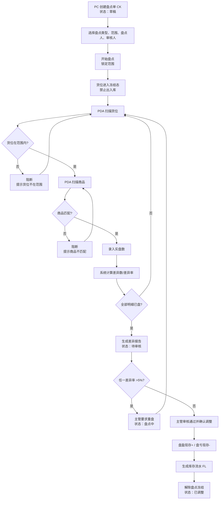
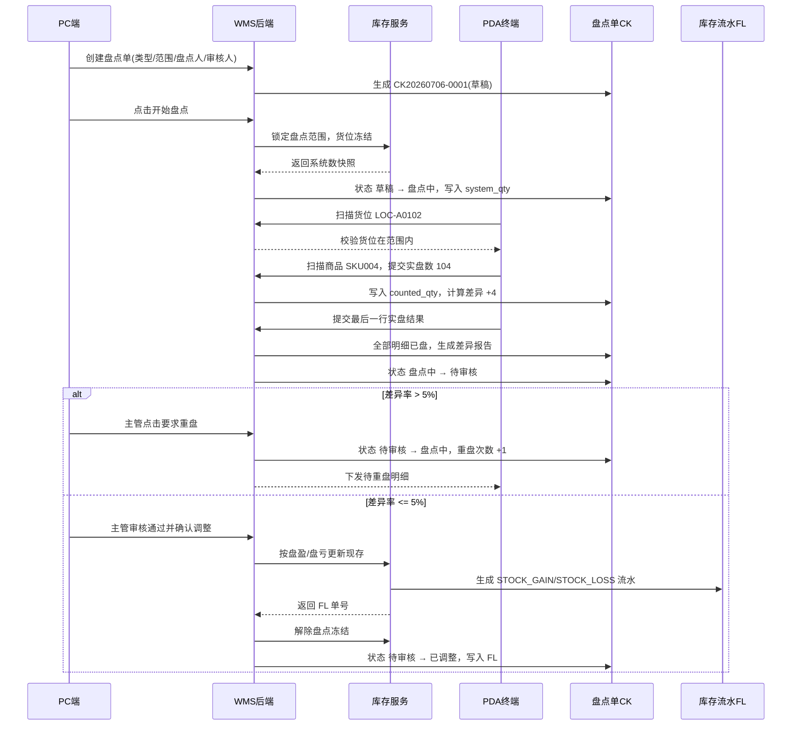

# 盘点单_业务流程推演

> 角色：业务流程推演 | 类型：执行作业单
> 使用 2026 年示例数据，推演创建 CK、锁定范围、PDA 实盘、差异报告、主管审核、库存调整和生成 FL 的全过程。

## 1. 沙盘数据

| 项 | 值 |
|:--|:--|
| 盘点单号 | CK20260706-0001 |
| 盘点类型 | `BLIND` 盲盘 |
| 仓库 | WH-SH-01 上海一仓 |
| 盘点范围 | 存储区 A 区，货位 A-01-02、A-01-05 |
| 盘点人 | U-CK-003 盘点员-陈晨 |
| 审核人 | U-MGR-001 仓库主管-李娜 |
| 创建时间 | 2026-07-06 08:30:00 |
| 开始盘点时间 | 2026-07-06 09:00:00 |

### 1.1 盘点明细

| 行 | 货位 | 货位条码 | SKU | 商品 | 系统数 | 单位 |
|:--:|:--|:--|:--|:--|--:|:--|
| 1 | A-01-02 | LOC-A0102 | SKU004 | 得力多功能计算器 | 100 | 台 |
| 2 | A-01-05 | LOC-A0105 | SKU002 | 晨光按动式中性笔黑色 | 200 | 支 |

## 2. 业务流程图

## 3. 系统时序图

## 4. 主流程步骤

| 步骤 | 角色 | 输入 | 系统处理 | 输出 |
|:--:|:--|:--|:--|:--|
| 1 | 仓库主管 | 盘点类型、范围、盘点人、审核人 | 创建 CK 草稿 | `draft` |
| 2 | 仓库主管 | 点击开始盘点 | 锁定范围，冻结货位，快照系统数 | `counting` |
| 3 | 盘点人 | PDA 扫货位 | 校验范围和冻结状态 | 允许扫商品或阻断 |
| 4 | 盘点人 | PDA 扫商品 | 校验 SKU | 允许录入实盘数 |
| 5 | 盘点人 | 实盘数 | 写入明细，计算差异 | 明细已盘 |
| 6 | 系统 | 全部明细已盘 | 汇总差异报告 | `pending_review` |
| 7 | 审核人 | 审核差异报告 | 判断差异率阈值 | 重盘或确认调整 |
| 8 | 系统 | 审核通过确认调整 | 更新现存，生成 FL，解冻 | `adjusted` |

## 5. 示例推演

### 5.1 第一行盘盈

| 项 | 值 |
|:--|:--|
| 货位 | A-01-02 |
| SKU | SKU004 |
| 系统数 | 100 |
| 实盘数 | 104 |
| 差异数 | +4 |
| 差异率 | 4% |
| 审核结果 | 未超过 5%，可审核通过 |
| 调整结果 | 现存 +4，生成 `STOCK_GAIN` FL |

### 5.2 第二行盘亏

| 项 | 值 |
|:--|:--|
| 货位 | A-01-05 |
| SKU | SKU002 |
| 系统数 | 200 |
| 实盘数 | 194 |
| 差异数 | -6 |
| 差异率 | 3% |
| 审核结果 | 未超过 5%，可审核通过 |
| 调整结果 | 现存 -6，生成 `STOCK_LOSS` FL |

### 5.3 超阈值重盘

| 项 | 值 |
|:--|:--|
| 货位 | B-02-01 |
| SKU | SKU007 |
| 系统数 | 80 |
| 首次实盘数 | 72 |
| 差异数 | -8 |
| 差异率 | 10% |
| 审核结果 | 主管必须要求重盘，状态 `pending_review` → `counting` |
| 重盘后 | 重新 PDA 实盘并再次生成差异报告 |

## 6. 异常流程

### 6.1 盘点中货位发生出入库请求

- 条件：CK 已进入盘点中，货位 A-01-02 已冻结。
- 处理：入库、出库、调拨请求命中该货位时阻断。
- 结果：提示“货位盘点中，禁止出入库”，库存数量不变。

### 6.2 PDA 扫错货位

- 条件：当前 CK 范围为 A-01-02、A-01-05，实扫 LOC-A0108。
- 处理：阻断确认，语音+震动提示“货位不在本次盘点范围内”。
- 结果：不写入实盘数。

### 6.3 PDA 扫错商品

- 条件：当前明细为 SKU004，实扫 SKU002。
- 处理：阻断确认，提示“商品不匹配，请核对商品”。
- 结果：不允许录入当前行实盘数。

### 6.4 离线同步冲突

- 条件：PDA 离线实盘后，网络恢复时 CK 已不是盘点中。
- 处理：同步失败，提示重新拉取任务。
- 结果：离线数据不覆盖已审核或已调整结果。

## 7. 流程边界

- CK 内完成差异报告、主管审核和库存调整，不拆独立差异调整单。
- 盘点中冻结使用库存规则中的 `冻结` 态。
- 确认调整只更新现存，盘盈 `+N`、盘亏 `-N`；占用不变，可用按公式重算。
- 已调整后 CK 只读，不允许继续修改实盘数。
