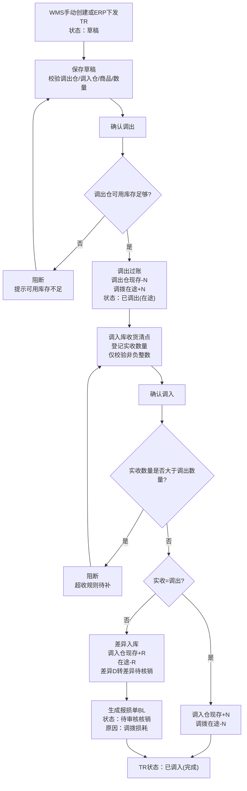
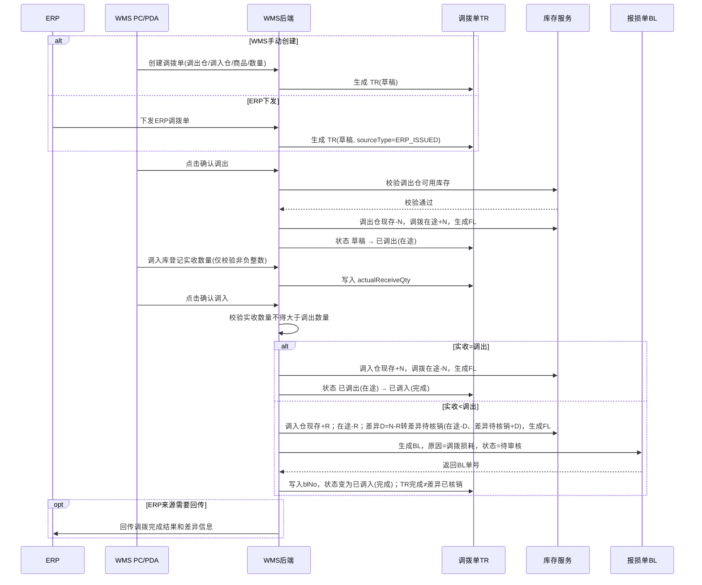

# 调拨单_业务流程推演

> 角色：业务流程推演 | 类型：执行作业单
> 使用 2026 年示例数据，推演 TR 从创建、调出、在途、调入到差异生成 BL 的全过程。

## 1. 沙盘数据

| 项 | 值 |
|:--|:--|
| 调拨单号 | TR20260706-0001 |
| 调拨类型 | 仓间调拨 |
| 来源 | WMS 手动 |
| 调出仓 | WH-SH-01 上海一仓 |
| 调入仓 | WH-BJ-01 北京一仓 |
| 商品 | SKU004 得力多功能计算器 |
| 调出数量 | 100 件 |
| 创建时间 | 2026-07-06 09:00:00 |

## 2. 业务流程图

## 3. 系统时序图

## 4. 主流程步骤

| 步骤 | 角色 | 输入 | 系统处理 | 输出 |
|:--:|:--|:--|:--|:--|
| 1 | 仓库主管/ERP | 调拨需求 | 生成 TR 草稿 | TR 状态=草稿 |
| 2 | 仓库主管 | 保存草稿 | 校验仓库、商品、数量 | 草稿保存成功 |
| 3 | 调出库 | 确认调出 | 校验调出仓可用库存 | 调出仓现存减少，在途增加 |
| 4 | 系统 | 调出结果 | 生成库存流水 FL | TR 状态=已调出（在途） |
| 5 | 调入库 | 登记实收 | 校验实收为 `≥0` 整数 | 写入实收数量 |
| 6 | 调入库 | 确认调入 | 先校验实收不得大于调出，再判断实收和调出是否一致 | 正常完成或差异完成 |
| 7 | 系统 | 差异数量 | 差异>0 时生成 BL | BL 原因=调拨损耗，状态=待审核 |
| 8 | 系统 | 完成结果 | 更新操作记录和 ERP 同步状态 | TR 状态=已调入（完成）；TR完成≠差异已核销 |

## 5. 正常调拨示例

### 5.1 调出确认

| 项 | 值 |
|:--|:--|
| TR | TR20260706-0001 |
| 调出仓 | WH-SH-01 上海一仓 |
| 调入仓 | WH-BJ-01 北京一仓 |
| SKU | SKU004 |
| 调出数量 | 100 |
| 调出前上海一仓现存/占用/可用 | 500 / 30 / 470 |
| 调出后上海一仓现存/占用/可用 | 400 / 30 / 370 |
| 调拨在途 | 0 → 100 |
| TR 状态 | 草稿 → 已调出（在途） |

### 5.2 调入确认

| 项 | 值 |
|:--|:--|
| 实收数量 | 100 |
| 差异数量 | 0 |
| 调入前北京一仓现存/占用/可用 | 200 / 20 / 180 |
| 调入后北京一仓现存/占用/可用 | 300 / 20 / 280 |
| 调拨在途 | 100 → 0 |
| TR 状态 | 已调出（在途） → 已调入（完成） |
| BL | 不生成 |

## 6. 到货差异示例

| 项 | 值 |
|:--|:--|
| TR | TR20260706-0002 |
| 调出仓 | WH-SZ-01 深圳仓 |
| 调入仓 | WH-CD-01 成都仓 |
| SKU | SKU002 晨光按动式中性笔黑色 |
| 调出数量 | 80 |
| 实收数量 | 76 |
| 差异数量 | 4 |

### 6.1 差异处理结果

| 处理 | 结果 |
|:--|:--|
| 调出确认 | 深圳仓现存-80，调拨在途+80 |
| 调入确认 | 成都仓现存+76；在途-76；差异4件转「差异待核销」（在途-4、差异待核销+4） |
| BL 生成 | 生成 `BL20260706-0002`，原因=`调拨损耗`，数量=4，状态=待审核 |
| TR 完成 | TR 状态=已调入（完成），关联 BL；差异部分资产核销由 BL 走 待审核→核销，TR完成≠差异已核销 |

## 7. 异常流程

### 7.1 调出库存不足

- 条件：调出数量 100，调出仓可用库存 90。
- 处理：阻断确认调出，提示“调出仓可用库存不足”。
- 结果：TR 保持草稿，不变更现存、可用、在途。

### 7.2 实收大于调出

- 条件：调出数量 80，调入登记实收 82。
- 处理：确认调入时阻断，提示“实收数量不能大于调出数量”。
- 结果：TR 保持已调出（在途），不生成 BL。
- 说明：context 未定义超收差异处理，需后续补规则。

### 7.3 BL 生成失败

- 条件：实收小于调出，差异入库时 BL 生成失败。
- 处理：阻断完成调入，提示“差异报损单生成失败，请重试”。
- 结果：库存过账和 TR 完成不得部分成功；研发需保证事务一致性。

## 8. 流程边界

- BL 套件已产出，本套件仅定义 TR 差异触发/关联口径，详见 报损管理/报损单/。
- 在途库存只存在于调出确认到调入确认之间，且不可销售。
- TR 不处理第三方物流、运输轨迹和硬件选型。
- ERP 完整接口协议未在 context 定义，本文只保留产品级对接口径。
