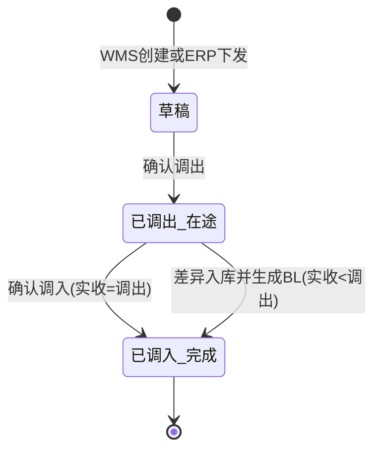

# 调拨单_业务规则规格

> 角色：业务规则规格 | 类型：执行作业单
> 覆盖调拨单状态机、动作按钮、调出/调入库存过账、在途限制、差异生成 BL 和 ERP 来源规则。

## 1. 状态机

二期不做草稿作废：草稿只能「保存草稿」或「确认调出」，无作废/删除动作；不新增 `CANCELLED` 状态。

| 当前状态 | 动作 | 目标状态 | 触发端 | 前置条件 | 后置结果 |
|:--|:--|:--|:--|:--|:--|
| - | 创建调拨单 | 草稿 | PC/接口 | WMS 手动创建或 ERP 下发 | 生成 TR，状态=DRAFT |
| 草稿 | 保存草稿 | 草稿 | PC | 基础字段校验通过；二期无草稿作废/删除动作 | 更新 TR，不变更库存 |
| 草稿 | 确认调出 | 已调出（在途） | PC/PDA | 调出仓库存足够，调出明细完整 | 调出仓现存-N，调拨在途+N，生成 FL |
| 已调出（在途） | 登记实收 | 已调出（在途） | PC/PDA | 实收数量为非负整数 | 更新实收数量，不变更库存 |
| 已调出（在途） | 确认调入 | 已调入（完成） | PC/PDA | 全部明细实收=调出 | 调入仓现存+N，调拨在途-N，生成 FL |
| 已调出（在途） | 差异入库 | 已调入（完成） | PC/PDA/系统 | 存在实收<调出 | 按实收 R 入库；差异 D=N-R 转「差异待核销」；生成 BL（待审核） |

## 2. 动作按钮规则

| 按钮/动作 | 展示状态 | 校验 | 说明 |
|:--|:--|:--|:--|
| 新建调拨单 | 列表页 | 用户有 WMS 手动创建权限 | ERP 下发不通过该按钮创建 |
| 保存草稿 | 草稿 | 必填和数量校验 | 不变更库存 |
| 确认调出 | 草稿 | 调出仓可用库存足够，明细完整 | 触发调出库存过账 |
| 登记实收 | 已调出（在途） | 实收数量为非负整数 | 可逐行登记，不完成状态；上限校验在确认调入执行 |
| 确认调入 | 已调出（在途）且无差异 | 全部实收=调出 | 正常完成 |
| 差异入库 | 已调出（在途）且有差异 | 全部实收已登记，实收<调出 | 生成 BL（待审核）后完成；差异部分资产核销由 BL 走 待审核→核销；TR 完成≠差异已核销 |
| 查看 BL | 已调入（完成）且有关联 BL | 有 blNo | 跳转 BL 详情；BL 套件已产出，本套件仅定义 TR 差异触发/关联口径，详见 报损管理/报损单/ |

按钮不可用时隐藏，不展示灰色 disabled 态。状态字段只读，不允许直接编辑。

## 3. 创建与来源规则

| 编号 | 规则 | 说明 |
|:--|:--|:--|
| TR-R01 | 单号生成 | TR 按 `TR{YYYYMMDD}-{4位序号}` 系统生成，已确认单号不回收 |
| TR-R02 | 来源枚举 | 来源只能是 `WMS_MANUAL` 或 `ERP_ISSUED` |
| TR-R03 | ERP 来源只读 | ERP 下发的调出仓、调入仓、商品、调出数量按接口带入，WMS 侧执行为主 |
| TR-R04 | 仓库校验 | 调出仓、调入仓必须为启用仓库，且不能相同 |
| TR-R05 | 数量校验 | 调出数量必须为正整数，确认调出前不得为空 |

## 4. 调出确认规则

| 编号 | 规则 | 说明 |
|:--|:--|:--|
| OUT-R01 | 状态限制 | 只有草稿 TR 可确认调出 |
| OUT-R02 | 可用校验 | 调出仓可用数量必须大于等于本次调出数量 |
| OUT-R03 | 现存扣减 | 确认调出后，调出仓现存数量减少 `lineTransferOutQty` |
| OUT-R04 | 在途增加 | 确认调出后，调拨在途数量增加 `lineTransferOutQty` |
| OUT-R05 | 可用变化 | 因现存减少，调出仓可用同步减少；占用、冻结不因 TR 改变 |
| OUT-R06 | 流水记录 | 调出确认生成库存流水 FL，记录来源单号为 TR |
| OUT-R07 | 不可重复 | 已调出或已调入的 TR 不允许再次确认调出 |

## 5. 在途库存规则

| 编号 | 规则 | 说明 |
|:--|:--|:--|
| TRANSIT-R01 | 在途期间 | 在途仅存在于调出库确认到调入库确认之间 |
| TRANSIT-R02 | 不可销售 | 在途库存不可销售，不允许被销售订单占用 |
| TRANSIT-R03 | 不计可用 | 在途数量不计入调出仓或调入仓可用库存 |
| TRANSIT-R04 | 可追溯 | 在途库存必须能追溯 TR、调出仓、调入仓、商品和数量 |
| TRANSIT-R05 | 完成消减 | TR 已调入后，相关在途数量必须归零；差异 D 件转「差异待核销」，不二次扣现存 |

## 6. 调入确认规则

| 编号 | 规则 | 说明 |
|:--|:--|:--|
| IN-R01 | 状态限制 | 只有已调出（在途）的 TR 可确认调入 |
| IN-R02 | 实收必填 | 确认调入前，所有明细必须登记实收数量 |
| IN-R03 | 数量上限 | 实收数量不得大于调出数量；超收场景 context 未定义，二期先阻断 |
| IN-R04 | 正常入库 | 实收=调出时，调入仓现存增加实收数量 |
| IN-R05 | 在途消减 | 正常入库时，调拨在途减少调出数量 |
| IN-R06 | 可用变化 | 调入仓现存增加后，可用同步增加；占用、冻结不因 TR 改变 |
| IN-R07 | 流水记录 | 调入确认生成库存流水 FL，记录来源单号为 TR |

## 7. 差异入库与 BL 生成规则

| 编号 | 规则 | 说明 |
|:--|:--|:--|
| DIFF-R01 | 差异判断 | `lineActualReceiveQty < lineTransferOutQty` 时产生差异 |
| DIFF-R02 | 差异计算 | `lineDiffQty = lineTransferOutQty - lineActualReceiveQty` |
| DIFF-R03 | 按实收入库 | 调入仓只按实收 R 增加现存 |
| DIFF-R04 | 在途清零 | 调入确认时在途先减少 R，差异 D=N-R 再从在途转「差异待核销」，TR 在途归零 |
| DIFF-R05 | 自动生成 BL | 差异总数>0 时自动生成报损单 BL，状态=待审核 |
| DIFF-R06 | BL 单号规则 | BL 单号按 `BL{YYYYMMDD}-{4位序号}` 生成 |
| DIFF-R07 | BL 原因 | BL 原因固定为 `调拨损耗` |
| DIFF-R08 | BL 关联 | BL 必须记录来源 TR 单号、调出仓、调入仓、SKU、差异数量 |
| DIFF-R09 | 套件边界 | BL 套件已产出，本套件仅定义 TR 差异触发/关联口径，详见 报损管理/报损单/ |

## 8. 库存口径

| 动作 | 调出仓现存 | 调出仓占用 | 调出仓可用 | 调拨在途 | 差异待核销 | 调入仓现存 | 调入仓可用 |
|:--|--:|--:|--:|--:|--:|--:|--:|
| 保存草稿 | 不变 | 不变 | 不变 | 不变 | 不变 | 不变 | 不变 |
| 确认调出 N | -N | 不变 | -N | +N | 不变 | 不变 | 不变 |
| 正常确认调入 N | 不变 | 不变 | 不变 | -N | 不变 | +N | +N |
| 差异确认调入，调出 N，实收 R，差异 D=N-R | 不变 | 不变 | 不变 | -R，再-D | +D | +R | +R |

> 可用口径沿用 `06-库存管理规则`：可用 = 现存 - 占用 - 冻结。在途、差异待核销为独立不可用口径，不可销售。差异 D 件由 BL 走 待审核→核销，TR 完成≠差异已核销。

## 9. 权限规则

| 角色 | 权限 | 说明 |
|:--|:--|:--|
| 仓库主管 | 新建 TR、保存草稿、确认调出、确认调入、查看详情 | WMS 手动调拨主体角色 |
| 调出库作业员 | 查看本人仓库 TR、执行调出确认 | 可按仓库授权 |
| 调入库作业员 | 查看调入仓 TR、登记实收、确认调入 | 可按仓库授权 |
| 只读账号 | 查看列表/详情 | 产品、测试、财务复核 |
| 系统/接口 | ERP 下发生成 TR、自动生成 BL、生成 FL | 无人工页面入口 |

## 10. ERP 对接规则

| 编号 | 规则 | 说明 |
|:--|:--|:--|
| ERP-R01 | 下发方向 | ERP 调拨单下发到 WMS，生成来源为 ERP 下发的 TR |
| ERP-R02 | ERP来源单号 | ERP 来源单号写入 `sourceErpOrderNo`，不可编辑 |
| ERP-R03 | 执行结果 | WMS 完成调入后可回传 TR 完成结果、实收数量、差异数量和关联 BL |
| ERP-R04 | 失败处理 | 回传失败只影响 `erpSyncStatus`，不回滚已完成库存过账 |
| ERP-R05 | 不确定性 | 完整接口字段、重试策略、幂等键未在 context 定义，需后续接口文档补齐 |

## 11. 异常和边界

| 场景 | 处理 |
|:--|:--|
| 调出仓库存不足 | 阻断确认调出，提示可用库存不足 |
| 调出仓=调入仓 | 阻断保存/确认 |
| 已调出后尝试修改调出数量 | 不允许修改 |
| 实收为空 | 阻断确认调入 |
| 实收大于调出 | 阻断确认，标记为超收异常待补规则 |
| BL 生成失败 | 调入确认不得完成，需提示“差异报损单生成失败，请重试” |
