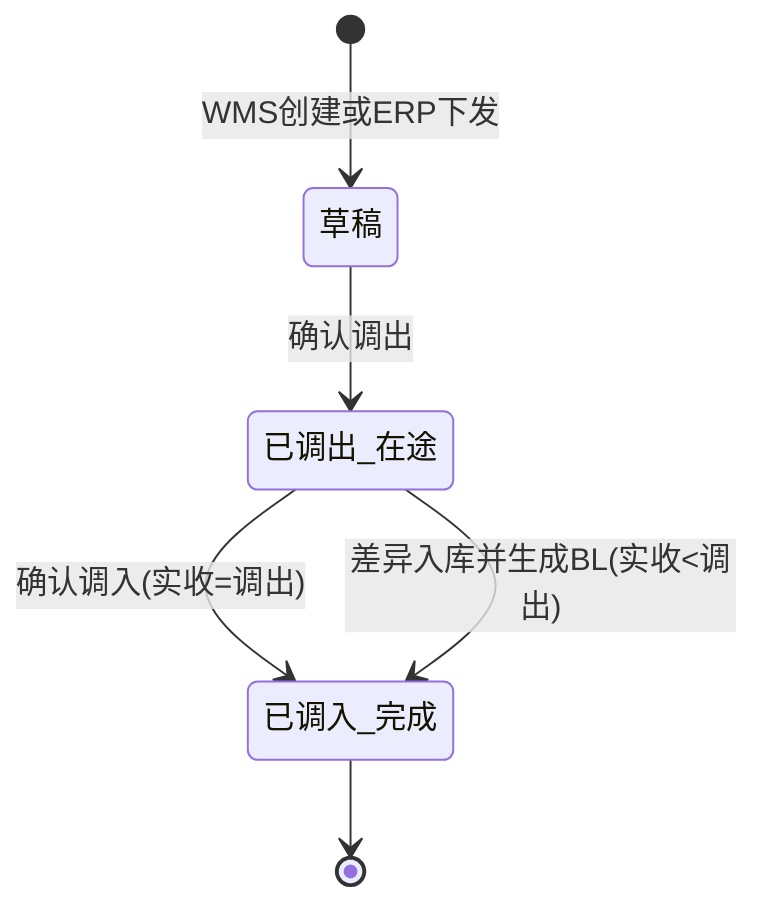

# 调拨单主PRD

> 本模块为二期规划。
> 角色：主PRD | 类型：执行作业单
> 权威层级：context/ > 本文件
> 关联文件：`调拨单字段清单.md` `调拨单_业务规则规格.md` `调拨单_业务流程推演.md` `调拨单_用例数据推演.md`

## 1. 业务背景

调拨单（TR）是 Forge WMS 二期规划中的仓间调拨执行单据，用于支撑不同仓库之间的库存转移。它覆盖“创建调拨单 → 调出库确认出库 → 调入库收货清点 → 调入确认完成”的分步作业。

一期 WMS 已覆盖基础数据、入库、出库、库存、盘点和 PDA 执行，不包含仓间调拨。二期需要把仓间补货、仓库间库存平衡、ERP 下发调拨执行纳入 WMS，确保库存从调出确认到调入确认之间有明确的在途状态，且在途库存不可销售。

## 2. 功能范围

### 2.1 一期不做

| 范围 | 说明 |
|:--|:--|
| 仓间调拨单 TR | 一期模块清单未包含调拨管理，不创建 TR |
| ERP 调拨下发 | 一期只在采购/销售链路对接 ERP，不处理 ERP 调拨单 |
| 调拨在途库存 | 一期库存状态虽定义在途，但不承载 TR 分步调拨流程 |
| 调拨差异报损 | 一期不由 TR 自动生成 BL 差异报损单 |

### 2.2 二期做

| 功能 | 端 | 说明 |
|:--|:--|:--|
| WMS 手动创建调拨单 | PC | 仓库主管创建仓间调拨需求，生成 TR 草稿 |
| ERP 下发调拨单 | 接口 | ERP 下发调拨需求到 WMS，生成 TR 草稿 |
| 调出确认 | PC/PDA | 调出库确认出库，扣调出仓现存，增加调拨在途 |
| 调入收货清点 | PC/PDA | 调入库登记实收数量，支持逐行清点 |
| 调入确认 | PC/PDA | 实收等于调出时，按调出数量入库并消减在途 |
| 到货差异处理 | 系统 | 实收少于调出时，按实收入库，同时生成 BL 差异报损单 |
| 列表/详情追踪 | PC | 查询 TR 状态、在途数量、差异、关联 BL 和操作记录 |

### 2.3 不在本次范围

- BL 套件已产出，本套件仅定义 TR 差异触发/关联口径，详见 报损管理/报损单/。
- 不涉及第三方物流、快递、运输系统对接。
- 不涉及 PDA、扫码枪、打印机等硬件选型。
- 不做前端 UI 实现，仅定义产品设计层文档和 Demo 页面结构。
- 不定义 ERP 调拨接口的完整字段协议；本文只保留来源单号、回传结果、差异单关联等产品口径。

## 3. 单据定位

| 项 | 说明 |
|:--|:--|
| 单据名称 | 调拨单 |
| 单据编码 | TR |
| 单号规则 | `TR{YYYYMMDD}-{4位序号}`，如 `TR20260705-0001` |
| 调拨类型 | 仓间调拨、ERP 下发调拨 |
| 来源 | WMS 手动、ERP 下发 |
| 上游来源 | WMS 手工录入或 ERP 调拨单 |
| 下游去向 | 库存流水 FL；差异场景生成报损单 BL |
| 业务定位 | 记录跨仓库存从调出、在途到调入完成的全过程，并承载调拨差异处理 |

## 4. 业务场景

| # | 场景 | 示例 | 系统处理 |
|:--:|:--|:--|:--|
| 1 | 正常仓间调拨 | 上海一仓调 100 台 SKU004 到北京一仓，实收 100 台 | 调出确认后现存-100、在途+100；调入确认后现存+100、在途-100 |
| 2 | ERP 下发调拨 | ERP 下发调拨单，要求深圳仓调 80 件到成都仓 | WMS 生成 TR 草稿，来源标记 ERP 下发，来源单号只读 |
| 3 | 到货差异 | 调出 80 件，调入清点实收 76 件 | 调入仓按 76 件入库；差异 4 件转「差异待核销」；生成 BL 4 件（待审核），原因=调拨损耗 |
| 4 | 在途不可销售 | 调出确认后，商品处于调拨途中 | 在途数量不计入可用，不允许销售或出库占用 |
| 5 | 超收异常 | 实收数量大于调出数量 | context 未定义超收处理；二期 Demo 先阻断确认，待补异常规则 |

## 5. 状态机

调拨单不增加审核流。状态变更必须由动作按钮触发，不允许直接编辑状态字段。二期不做草稿作废：草稿只能「保存草稿」或「确认调出」，无作废/删除动作。

| 状态 | 含义 | 可执行动作 | 进入条件 |
|:--|:--|:--|:--|
| 草稿 | TR 已创建，尚未调出确认；二期不做草稿作废 | 保存草稿、确认调出、查看详情；无作废/删除动作 | WMS 手动创建或 ERP 下发 |
| 已调出（在途） | 调出仓已扣减现存，库存进入在途 | 登记实收、确认调入、差异入库 | 调出确认成功 |
| 已调入（完成） | 调入确认完成，在途已消减；差异 D 件以「差异待核销」挂调入仓，TR 完成≠差异已核销 | 查看详情、查看 BL | 调入确认成功；差异时已触发 BL（待审核） |

### 5.1 差异分支

| 条件 | 处理 |
|:--|:--|
| `actualReceiveQty = transferOutQty` | 调入仓现存增加调出数量，调拨在途消减调出数量，TR 完成 |
| `actualReceiveQty < transferOutQty` | 调入仓现存+R；在途-R；差异 D=N-R 转「差异待核销」（在途-D、差异待核销+D）；系统生成 BL（待审核），原因固定为 `调拨损耗`。差异部分资产核销由 BL 走 待审核→核销，TR 完成≠差异已核销 |
| `actualReceiveQty > transferOutQty` | context 未定义；二期 Demo 阻断提交，不生成 BL，需后续补超收规则 |

## 6. 规则摘要

| # | 规则 | 摘要 |
|:--:|:--|:--|
| R1 | 单号规则 | TR 单号按 `TR{YYYYMMDD}-{4位序号}` 系统生成，不可编辑 |
| R2 | 来源规则 | TR 来源为 WMS 手动或 ERP 下发；ERP 来源单号只读 |
| R3 | 调出确认 | 调出库确认后，调出仓现存-N，调拨在途+N |
| R4 | 在途不可销售 | 在途库存处于调出确认到调入确认之间，不计入可用，不可销售 |
| R5 | 调入确认 | 实收等于调出时，调入仓现存+N，调拨在途-N |
| R6 | 差异入库 | 实收小于调出时，调入仓现存+R；在途-R；差异 D=N-R 转「差异待核销」（在途-D、差异待核销+D） |
| R7 | 差异报损 | 到货差异自动生成 BL（待审核），单号按 `BL{YYYYMMDD}-{4位序号}`，原因=`调拨损耗`；TR 完成≠差异已核销 |
| R8 | 字段口径 | 字段唯一事实来源为 `调拨单字段清单.md` |

## 7. 字段清单入口

字段的唯一事实来源见 `调拨单字段清单.md`。本主 PRD 只保留字段分类摘要：

| 分类 | 核心字段 |
|:--|:--|
| 调拨头 | 调拨单号、调拨类型、来源、ERP来源单号、调出仓、调入仓、状态、调出总数、实收总数、差异总数 |
| 调拨明细 | 商品、调出数、实收数、差异数、调出货位、调入货位、明细状态 |
| 系统字段 | 创建人、创建时间、调出确认人、调出确认时间、调入确认人、调入确认时间、关联 BL、操作记录 |

## 8. 验收标准

| # | 验收项 | 验收标准 |
|:--:|:--|:--|
| AC1 | 二期标识 | 主 PRD 开头明确标注“本模块为二期规划” |
| AC2 | 范围边界 | 明确一期不做、二期做；BL 套件已产出，本套件仅定义 TR 差异触发/关联口径 |
| AC3 | 单号规则 | TR 符合 `TR{YYYYMMDD}-{4位序号}`；差异 BL 符合 `BL{YYYYMMDD}-{4位序号}` |
| AC4 | 状态流转 | 草稿 → 已调出（在途） → 已调入（完成），仅动作按钮触发 |
| AC5 | 调出过账 | 确认调出后调出仓现存-N，调拨在途+N |
| AC6 | 在途限制 | 在途库存不可销售，不计入可用 |
| AC7 | 调入过账 | 正常调入后调入仓现存+N，调拨在途-N |
| AC8 | 差异处理 | 实收小于调出时按实收 R 入库，差异 D 转「差异待核销」，并生成原因=调拨损耗的 BL（待审核）；TR 完成≠差异已核销 |
| AC9 | Demo 数据 | 用例数据使用 2026 示例，清楚展示两仓现存/在途变化 |

## 9. 不确定性

- ERP 调拨下发和结果回传的完整接口字段未在 context 中展开；本文仅定义产品口径，接口协议需后续单独补充。
- BL 套件已产出，本套件仅定义 TR 差异触发/关联口径，详见 报损管理/报损单/。
- context 只定义“调拨损耗”报损，未定义实收大于调出时的超收处理；二期 Demo 先阻断超收确认。
